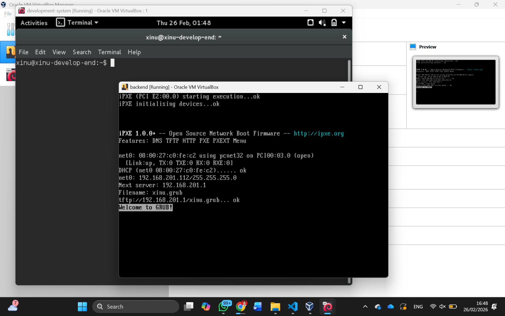

# <h1 align="center">Laporan Praktikum Modul 2   Instalasi Xinu </h1>

Muhammad Rifqi Al Baqi Ananta - 2311104005 

---

## Dasar Teori

Xinu (Xinu Is Not Unix) merupakan sistem operasi yang dirancang untuk tujuan edukasi dan penelitian dalam bidang sistem operasi. Xinu memiliki desain yang sederhana namun tetap mencakup konsep-konsep penting dalam sistem operasi seperti manajemen proses, komunikasi antar proses, manajemen memori, serta mekanisme interrupt. Karena kesederhanaannya, Xinu sering digunakan dalam pembelajaran sistem operasi agar mahasiswa dapat memahami bagaimana sistem operasi bekerja secara lebih mendalam.

Pada praktikum ini, Xinu dijalankan menggunakan lingkungan virtual machine. Virtual machine memungkinkan pengguna menjalankan beberapa sistem operasi dalam satu perangkat keras yang sama tanpa harus melakukan instalasi langsung pada perangkat fisik. Hal ini memberikan fleksibilitas dalam proses eksperimen serta meminimalkan risiko kerusakan pada sistem utama.

Dalam proses instalasi Xinu pada praktikum ini digunakan dua buah virtual machine yaitu **development-system** dan **backend**. Virtual machine **development-system** merupakan sistem berbasis Debian Linux yang berfungsi sebagai lingkungan pengembangan. Pada mesin ini praktikan akan melakukan aktivitas seperti mengedit source code, melakukan proses kompilasi, serta membangun image sistem operasi Xinu.

Sementara itu, virtual machine **backend** berfungsi sebagai target komputer yang akan menjalankan sistem operasi Xinu yang telah dibuat pada development-system. Konsep ini umum digunakan dalam pengembangan embedded system dimana proses pengembangan dilakukan pada satu mesin, kemudian hasilnya dijalankan pada mesin target yang berbeda.

Dengan menggunakan dua virtual machine tersebut, praktikan dapat memahami alur pengembangan sistem operasi mulai dari proses penulisan kode, kompilasi, hingga proses menjalankan sistem operasi pada perangkat target. Pendekatan ini juga memberikan gambaran nyata mengenai bagaimana sistem operasi dikembangkan dan dijalankan pada perangkat embedded.

Melalui modul ini, praktikan diharapkan dapat memahami proses instalasi Xinu OS, melakukan konfigurasi virtual machine pada VirtualBox, serta memahami arsitektur dasar sistem Xinu yang digunakan dalam proses pengembangannya.

---

## Guided

Pada modul ini dilakukan proses instalasi serta konfigurasi lingkungan kerja untuk menjalankan Xinu OS menggunakan VirtualBox. Proses ini melibatkan import file virtual machine serta pengaturan jaringan dan serial port agar kedua virtual machine dapat saling berkomunikasi.

Langkah-langkah yang dilakukan antara lain:

1. Menjalankan **Oracle VM VirtualBox** pada komputer.
2. Mengekstrak file `xinu-vbox-appliances.tar.gz` hingga menghasilkan dua file yaitu:
   - `development-system.ova`
   - `backend.ova`
3. Mengimpor file **development-system.ova** melalui menu **File → Import Appliance** pada VirtualBox.
4. Mengatur konfigurasi **Network**, **Serial Ports**, dan **Display** pada virtual machine development-system.
5. Mengimpor file **backend.ova** melalui menu **File → Import Appliance**.
6. Mengatur konfigurasi **Network** dan **Serial Ports** pada virtual machine backend agar sesuai dengan development-system.
7. Memastikan kedua virtual machine telah terkonfigurasi dengan benar sehingga dapat digunakan untuk pengembangan dan menjalankan Xinu OS.

Setelah seluruh konfigurasi selesai dilakukan, maka akan terbentuk arsitektur sistem dimana **development-system** digunakan untuk melakukan pengembangan sistem operasi Xinu, sedangkan **backend VM** digunakan sebagai target komputer yang menjalankan Xinu OS hasil kompilasi.

Berikut merupakan tampilan hasil konfigurasi virtual machine pada VirtualBox.

Hasil tersebut menunjukkan bahwa kedua virtual machine telah berhasil diimpor dan dikonfigurasi dengan baik sehingga siap digunakan untuk proses pengembangan dan pengujian sistem operasi Xinu pada modul-modul berikutnya.

---