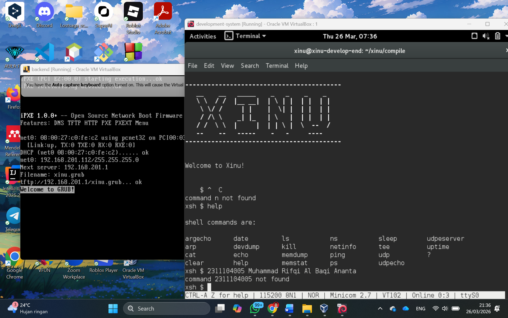

# <h1 align="center">Laporan Praktikum Modul 3   Eksplorasi Xinu</h1>

Muhammad Rifqi Al Baqi Ananta - 2311104005

---

## Dasar Teori

Modul 3 membahas tentang eksplorasi sistem operasi Xinu (Xinu Is Not Unix), yaitu sistem operasi ringan yang digunakan untuk tujuan pembelajaran konsep dasar sistem operasi. Xinu menerapkan konsep cross-development, di mana proses pengembangan dilakukan pada development-system, sedangkan eksekusi dilakukan pada backend machine melalui jaringan.

Dalam implementasinya, Xinu dijalankan menggunakan dua virtual machine. Development-system digunakan untuk melakukan kompilasi program serta menyediakan layanan jaringan seperti DHCP dan TFTP, sedangkan backend VM bertugas menjalankan sistem Xinu melalui proses booting jaringan (PXE). 

Xinu menyediakan shell interaktif dengan prompt `xsh$` yang memungkinkan pengguna menjalankan berbagai perintah untuk mengelola sistem. Melalui shell ini, pengguna dapat melihat proses yang berjalan, konfigurasi jaringan, serta melakukan berbagai operasi dasar sistem. Dengan melakukan eksplorasi ini, praktikan dapat memahami konsep seperti manajemen proses, prioritas proses, serta state proses dalam sistem operasi.

---

## Guided

Pada praktikum ini dilakukan proses menjalankan Xinu menggunakan VirtualBox dengan dua virtual machine, yaitu development-system dan backend. Setelah development-system dijalankan, dilakukan login menggunakan username **xinu** dan password **xinurocks**, kemudian masuk ke direktori compile menggunakan perintah `cd xinu/compile`. Selanjutnya dilakukan pembersihan file kompilasi sebelumnya dengan `make clean` dan dilanjutkan dengan proses kompilasi menggunakan `make`.

Setelah proses kompilasi selesai, dilakukan komunikasi dengan backend menggunakan perintah `sudo minicom`. Kemudian backend VM dijalankan hingga muncul proses booting melalui PXE yang menunjukkan bahwa sistem berhasil mengambil image Xinu dari development-system. Setelah berhasil, muncul tampilan Xinu dengan prompt `xsh$` yang menandakan bahwa sistem siap digunakan.

Selanjutnya dilakukan eksplorasi menggunakan perintah `help` untuk melihat daftar perintah yang tersedia pada shell Xinu, serta perintah `ps` dan `devdump` untuk melihat informasi proses dan jaringan.

Berikut merupakan hasil tampilan eksplorasi Xinu:

### Hasil Eksplorasi

**1. Berapa jumlah perintah pada Xinu?**  
Jawaban: Berdasarkan perintah `help`, terdapat lebih dari 20 perintah yang tersedia pada shell Xinu.

**2. Sebutkan 2 perintah yang mempunyai fungsi yang sama!**  
Jawaban: Perintah `help` dan `?` memiliki fungsi yang sama, yaitu menampilkan daftar perintah.

**3. Berapa IP address Xinu?**  
Jawaban: IP address Xinu berada pada jaringan **192.168.201.x**.

**4. Perintah apa yang digunakan untuk mengetahui IP address?**  
Jawaban: Perintah yang digunakan adalah `devdump` atau `netinfo`.

**5. Berapa IP DNS server yang digunakan oleh Xinu?**  
Jawaban: DNS/server jaringan yang digunakan adalah **192.168.201.1**.

**6. Terdapat berapa proses yang sedang berjalan pada Xinu?**  
Jawaban: Jumlah proses dapat dilihat menggunakan perintah `ps`, yaitu terdapat beberapa proses aktif dalam sistem.

**7. Proses apa yang mempunyai prioritas paling rendah?**  
Jawaban: Proses dengan prioritas paling rendah adalah **prnull**.

**8. Proses apa yang mempunyai ukuran paling besar?**  
Jawaban: Proses dengan ukuran paling besar adalah **Main**.

**9. Proses apa yang berada dalam state current?**  
Jawaban: Proses yang berada dalam state current adalah proses **shell** yang sedang aktif.

**10. Proses apa yang berada dalam state suspend?**  
Jawaban: Proses dalam state suspend adalah proses yang sedang tidak aktif sementara, seperti proses I/O.

**11. Berapa PID (Process ID) dari Main process?**  
Jawaban: PID dari Main process adalah **1**.

Hasil ini menunjukkan bagaimana Xinu mengelola proses, memori, dan jaringan secara sederhana namun tetap mencerminkan konsep dasar sistem operasi.

---

## Referensi
1. Modul Praktikum Sistem Operasi  