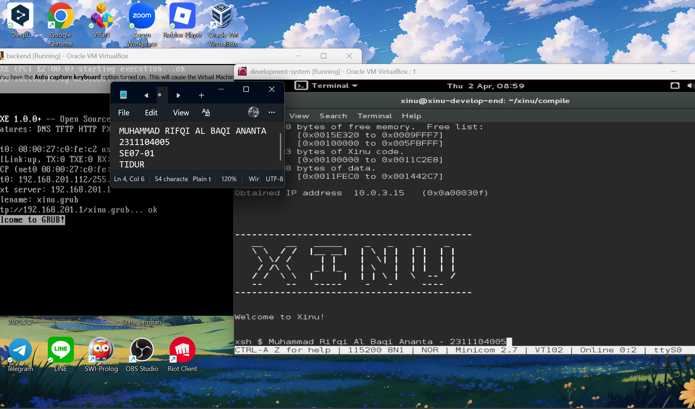
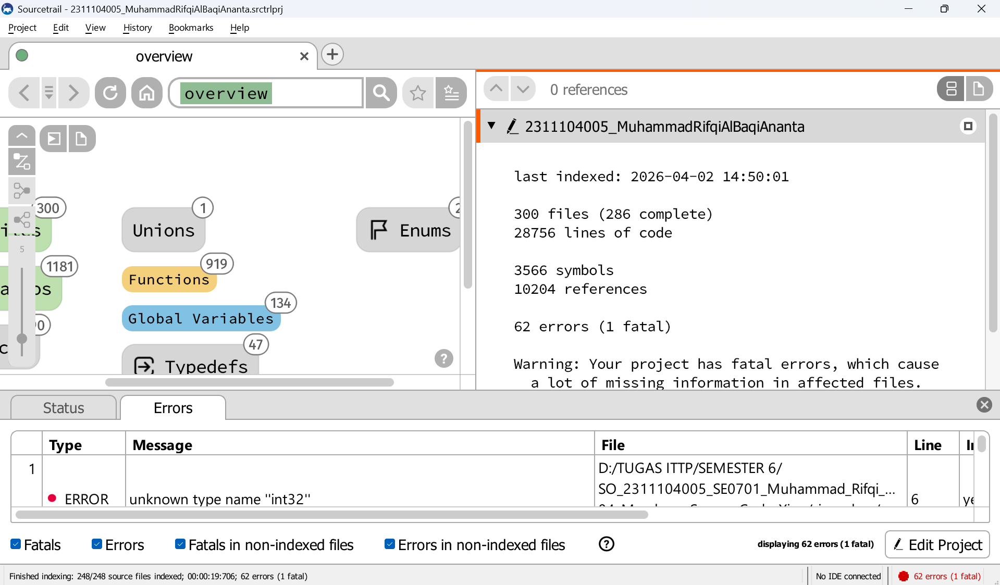
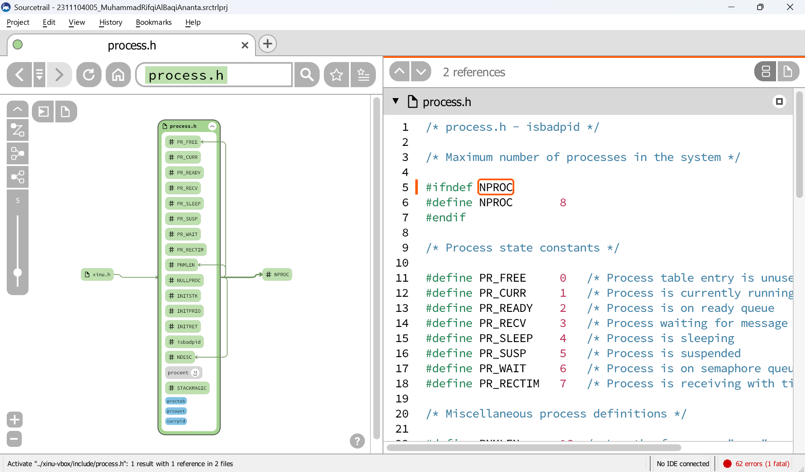

# <h1 align="center">Laporan Praktikum Modul 4   Membaca Source Code Xinu </h1>

Muhammad Rifqi Al Baqi Ananta - 2311104005

## Dasar Teori

Xinu (Xinu Is Not Unix) merupakan sistem operasi sederhana yang dikembangkan untuk tujuan pembelajaran, khususnya dalam memahami konsep dasar sistem operasi seperti manajemen proses, memori, serta interaksi antar komponen sistem. Xinu dirancang dengan struktur source code yang modular sehingga memudahkan pengguna dalam membaca, memahami, serta melakukan modifikasi pada sistem.

Struktur direktori dalam Xinu terdiri dari beberapa bagian penting, di antaranya direktori `include/` yang berisi file header (.h), direktori `system/` yang berisi implementasi inti sistem, direktori `shell/` yang berisi perintah-perintah shell, serta direktori `compile/` yang digunakan untuk proses kompilasi. Dengan struktur ini, pengembang dapat dengan mudah menelusuri fungsi dan alur kerja sistem operasi.

Dalam praktikum ini digunakan aplikasi Sourcetrail untuk membantu eksplorasi source code secara visual. Dengan bantuan Sourcetrail, praktikan dapat melihat hubungan antar fungsi, variabel, serta struktur data dalam sistem secara lebih jelas. Selain itu, praktikum ini juga melibatkan identifikasi struktur data proses serta modifikasi sederhana pada sistem Xinu.

---

## Pembahasan

Pada tahap awal, dilakukan proses kompilasi source code Xinu menggunakan perintah `make` pada direktori `xinu/compile`. Hasil dari proses ini adalah sebuah file image bernama `xinu.elf` yang digunakan untuk menjalankan sistem Xinu pada backend VM. File tersebut berada di dalam folder `compile/` dan memiliki ukuran tertentu yang dapat dilihat menggunakan perintah `ls -lh xinu.elf`.

📸 Screenshot proses kompilasi dan hasil file:

Selanjutnya dilakukan eksplorasi source code menggunakan aplikasi Sourcetrail. Praktikan membuat project baru, menambahkan seluruh folder Xinu, serta melakukan proses indexing. Setelah indexing selesai, struktur project dapat dilihat dengan jelas, termasuk jumlah file, fungsi, serta relasi antar komponen dalam sistem.

📸 Screenshot Sourcetrail:

Pada bagian berikutnya, dilakukan pencarian struktur data proses pada Xinu. Struktur ini ditemukan pada file `process.h` yang berada di dalam direktori `xinu/include/`. Struktur utama yang digunakan adalah `struct procent` yang berfungsi untuk menyimpan berbagai informasi terkait proses dalam sistem, seperti status proses (`prstate`), prioritas (`prprio`), pointer stack (`prstkptr`), alamat dasar stack (`prstkbase`), panjang stack (`prstklen`), nama proses (`prname`), serta informasi lainnya seperti semaphore, parent process, dan return value.

📸 Screenshot struktur proses:

Pada tahap terakhir, dilakukan modifikasi sederhana pada sistem Xinu, yaitu dengan mengubah welcome banner. Proses ini dilakukan dengan mengedit source code dan kemudian melakukan kompilasi ulang menggunakan perintah `make clean` dan `make`. Setelah itu, sistem dijalankan menggunakan `minicom` dan backend VM untuk melihat hasil perubahan.

📸 Screenshot hasil tampilan Xinu:

---

## Kesimpulan

Berdasarkan praktikum yang telah dilakukan, dapat disimpulkan bahwa memahami struktur source code merupakan hal yang sangat penting dalam pengembangan perangkat lunak, khususnya sistem operasi. Dengan memahami struktur direktori dan hubungan antar file dalam Xinu, praktikan dapat mengetahui bagaimana sistem bekerja secara keseluruhan.

Selain itu, penggunaan tools seperti Sourcetrail sangat membantu dalam proses eksplorasi kode karena mampu menampilkan hubungan antar komponen secara visual. Praktikum ini juga memberikan pengalaman langsung dalam melakukan modifikasi sederhana pada sistem, sehingga meningkatkan pemahaman terhadap implementasi kode dalam sistem nyata.

---

## Referensi

1. Modul Praktikum Sistem Operasi Modul 04  
2. Dokumentasi Sourcetrail  
3. https://xinu.cs.purdue.edu/