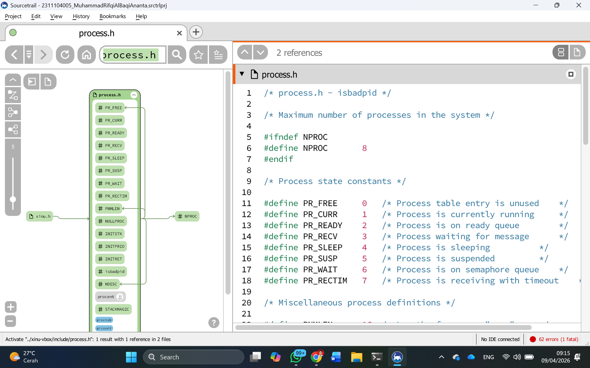

# <h1 align="center">Laporan Praktikum Modul 5   Xinu Process Exploration </h1>

Muhammad Rifqi Al Baqi Ananta - 2311104005

## 📝 Dasar Teori

Sistem operasi Xinu mengelola seluruh informasi proses melalui struktur data yang disebut **Process Table**. Setiap proses yang berjalan direpresentasikan sebagai satu entri dalam tabel ini.

### 1. Struktur Process Table
Implementasi tabel proses pada Xinu menggunakan array global bernama `proctab[]`. Setiap elemen dalam array ini adalah sebuah **PCB (Process Control Block)** yang didefinisikan dalam `struct procent` pada file `./include/process.h`.

### 2. Mekanisme Identifikasi (Implicit Data Structure)
Xinu menggunakan pendekatan *Implicit Data Structure*, di mana **Process ID (PID)** tidak disimpan sebagai variabel di dalam struct, melainkan menggunakan **indeks array** `proctab[]`. Sebagai contoh, jika kernel ingin memanipulasi proses dengan PID 3, maka kernel akan mengakses `proctab[3]`.

### 3. Source Code Utama Manajemen Proses
* `./include/process.h`: Berisi definisi struktur `procent` dan konfigurasi proses.
* `./system/create.c`: Fungsi untuk menciptakan proses baru.
* `./system/kill.c`: Fungsi untuk terminasi proses.
* `./system/resume.c`: Fungsi untuk memulai kembali proses yang sedang tertahan.

---

## 🛠️ Guided
Pada tahap ini, dilakukan eksplorasi file `process.h` menggunakan tool **Sourcetrail** untuk memahami keterkaitan antar fungsi dan struktur data dalam kernel Xinu.

---

## 📚 Referensi
1. Modul Praktikum Sistem Operasi Modul 05 - Universitas Telkom Purwokerto.