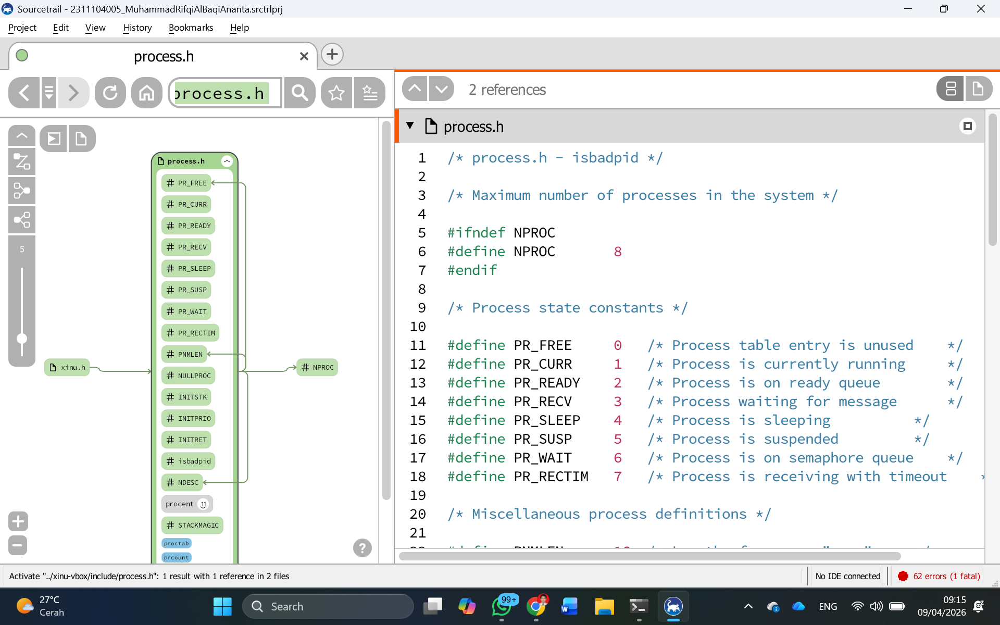
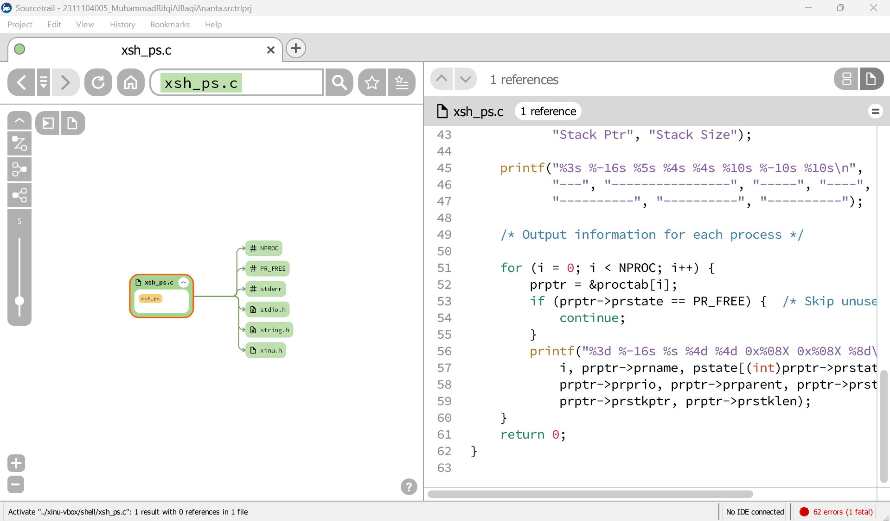
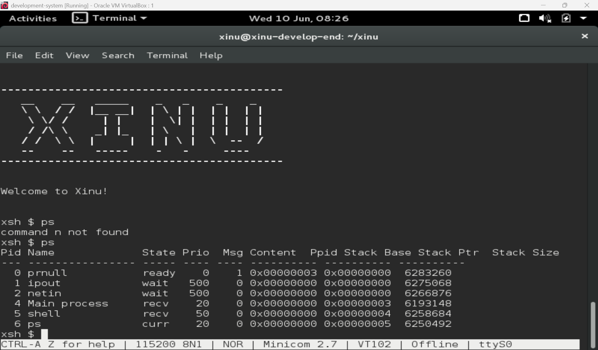
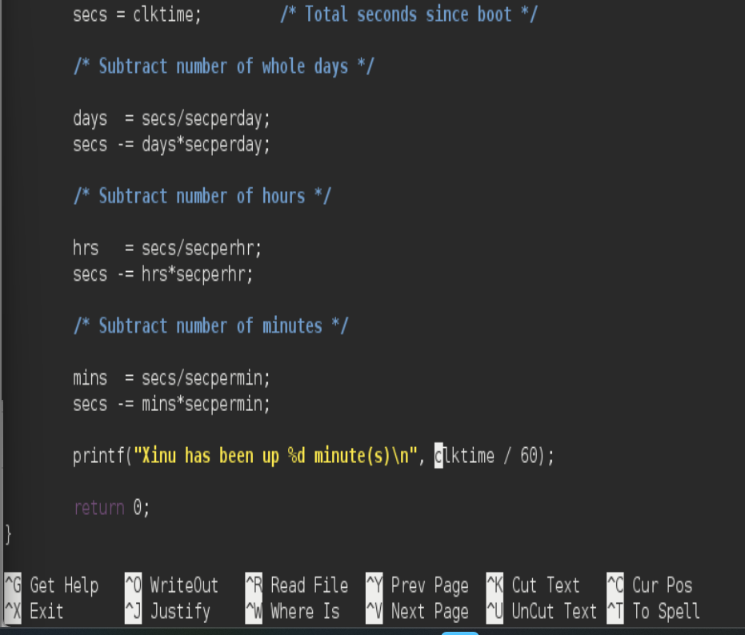
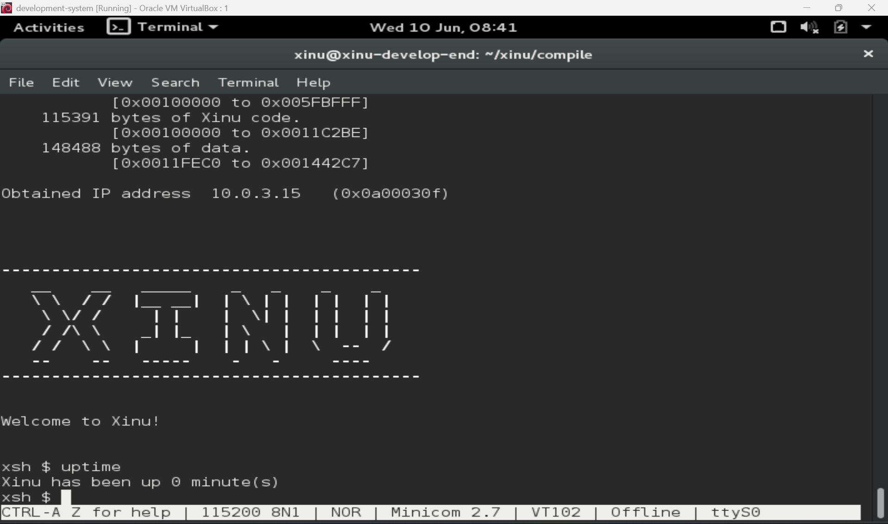

# <h1 align="center">Laporan Praktikum Modul 5   Xinu Process Exploration </h1>

Muhammad Rifqi Al Baqi Ananta - 2311104005

## 📝 Dasar Teori

Sistem operasi Xinu mengelola seluruh informasi proses melalui struktur data yang disebut **Process Table**. Setiap proses yang berjalan direpresentasikan sebagai satu entri dalam tabel ini.

### 1. Struktur Process Table

Implementasi tabel proses pada Xinu menggunakan array global bernama `proctab[]`. Setiap elemen dalam array ini adalah sebuah **PCB (Process Control Block)** yang didefinisikan dalam `struct procent` pada file `./include/process.h`.

### 2. Mekanisme Identifikasi (Implicit Data Structure)

Xinu menggunakan pendekatan *Implicit Data Structure*, di mana **Process ID (PID)** tidak disimpan sebagai variabel di dalam struct, melainkan menggunakan **indeks array** `proctab[]`. Sebagai contoh, jika kernel ingin memanipulasi proses dengan PID 3, maka kernel akan mengakses `proctab[3]`.

### 3. Source Code Utama Manajemen Proses

Beberapa file penting yang digunakan dalam pengelolaan proses pada Xinu adalah sebagai berikut:

* `./include/process.h` : Berisi definisi struktur `procent` dan berbagai konfigurasi proses.
* `./system/create.c` : Fungsi untuk membuat proses baru.
* `./system/kill.c` : Fungsi untuk menghentikan atau menghapus proses.
* `./system/resume.c` : Fungsi untuk melanjutkan proses yang sebelumnya ditangguhkan.

Melalui struktur dan fungsi-fungsi tersebut, Xinu dapat mengelola siklus hidup proses mulai dari proses dibuat, dijalankan, ditangguhkan, hingga dihentikan oleh sistem operasi.

---

## 🛠️ Guided

Pada tahap ini dilakukan eksplorasi terhadap struktur manajemen proses pada Xinu menggunakan aplikasi **Sourcetrail**. Eksplorasi difokuskan pada file `process.h` untuk memahami hubungan antara struktur data proses, konstanta yang digunakan, serta keterkaitan dengan fungsi-fungsi pengelolaan proses lainnya pada kernel Xinu.

Melalui Sourcetrail dapat diamati bahwa struktur `procent` menjadi pusat penyimpanan informasi setiap proses yang berjalan pada sistem. Selain itu, file ini juga berisi berbagai konfigurasi penting seperti jumlah maksimum proses, panjang nama proses, status proses, prioritas, stack, serta atribut lain yang digunakan oleh scheduler dan kernel.

---

## 🛠️ Unguided / Jurnal

### 1. Jawablah pertanyaan berikut!

#### a. Berapa banyaknya maksimum proses yang ada pada Xinu?

Jumlah maksimum proses yang dapat dikelola oleh sistem operasi Xinu adalah **50 proses**. Nilai tersebut ditentukan melalui konstanta `NPROC` yang terdapat pada file `process.h` dan digunakan sebagai ukuran dari tabel proses (`proctab`).

#### b. Berapa maksimal panjang nama suatu proses pada Xinu?

Panjang maksimum nama proses pada Xinu adalah **16 karakter**. Nilai tersebut ditentukan melalui konstanta `PNMLEN` yang terdapat pada file `process.h`.

#### c. Berapa nilai prioritas awal pada saat proses dibuat?

Prioritas awal proses pada Xinu tidak ditentukan secara tetap. Nilai prioritas diberikan melalui parameter `priority` saat fungsi `create()` dipanggil. Oleh karena itu, prioritas awal suatu proses bergantung pada nilai yang diberikan oleh programmer ketika proses dibuat.

#### d. Ada berapa total state pada Xinu? Sebutkan!

Xinu memiliki **7 state proses**, yaitu:

* `PR_FREE` : Slot proses kosong dan tidak digunakan.
* `PR_CURR` : Proses sedang dieksekusi oleh CPU.
* `PR_READY` : Proses siap dijalankan dan menunggu giliran CPU.
* `PR_RECV` : Proses sedang menunggu pesan.
* `PR_SLEEP` : Proses sedang berada dalam kondisi tidur (*sleep*).
* `PR_SUSP` : Proses sedang ditangguhkan (*suspended*).
* `PR_WAIT` : Proses sedang menunggu resource atau sinkronisasi.

---

### 2. Perintah ps adalah perintah untuk menampilkan statistik process yang berjalan. Source code dari ps tersimpan pada file xsh_ps.c. Carilah file tersebut dan beri komentar pada 20 baris terakhir di source code tersebut!

Pada tugas ini dilakukan eksplorasi terhadap file `xsh_ps.c` yang berfungsi untuk menampilkan informasi proses yang sedang berjalan pada sistem operasi Xinu. Selanjutnya dilakukan penambahan komentar pada 20 baris terakhir source code untuk memberikan dokumentasi yang lebih jelas mengenai fungsi setiap bagian kode sehingga memudahkan proses pemeliharaan dan pengembangan sistem di masa mendatang.

Komentar yang ditambahkan menjelaskan fungsi dari bagian-bagian kode yang bertanggung jawab untuk menampilkan header tabel proses, melakukan iterasi terhadap tabel proses, memeriksa status proses, serta menampilkan informasi proses ke layar.

---

### 3. Ubahlah perintah ps (source code: xsh_ps.c) pada Xinu sehingga menampilkan informasi tambahan berupa kolom yang berisi total message yang ada pada proses.

Pada tugas ini dilakukan modifikasi terhadap file `xsh_ps.c` agar perintah `ps` dapat menampilkan informasi tambahan mengenai pesan yang dimiliki oleh suatu proses.

Modifikasi dilakukan dengan menambahkan dua kolom baru yaitu:

* **Msg** : Menampilkan status keberadaan pesan pada proses melalui atribut `prhasmsg`.
* **Content** : Menampilkan isi pesan yang tersimpan pada proses melalui atribut `prmsg`.

Perubahan dilakukan dengan menambahkan kolom baru pada bagian header tabel dan menambahkan informasi `prhasmsg` serta `prmsg` pada bagian output setiap proses. Setelah dilakukan kompilasi ulang dan pengujian pada Backend VM, hasil modifikasi berhasil menampilkan informasi tambahan sesuai dengan kebutuhan praktikum.

---

### 4. Ubahlah perintah uptime pada Xinu sehingga menampilkan lamanya Xinu sejak booting hanya dalam satuan menit.

Pada kondisi awal, perintah `uptime` menampilkan lama sistem berjalan dalam format hari, jam, menit, dan detik. Pada tugas ini dilakukan modifikasi terhadap file `xsh_uptime.c` sehingga informasi uptime hanya ditampilkan dalam satuan menit.

Implementasi dilakukan dengan memanfaatkan variabel `clktime` yang menyimpan total detik sejak sistem booting. Nilai tersebut kemudian dikonversi ke satuan menit menggunakan operasi pembagian dengan angka 60 dan ditampilkan langsung menggunakan fungsi `printf()`.

Berikut merupakan source code hasil modifikasi:

Setelah dilakukan kompilasi ulang dan pengujian pada Backend VM, perintah `uptime` berhasil menampilkan lama sistem berjalan hanya dalam satuan menit seperti yang ditunjukkan pada gambar berikut.

---

## 📚 Referensi

1. Modul Praktikum Sistem Operasi Modul 05 – Universitas Telkom Purwokerto.
2. Comer, D. E. (2015). *Operating System Design: The Xinu Approach*. CRC Press.
