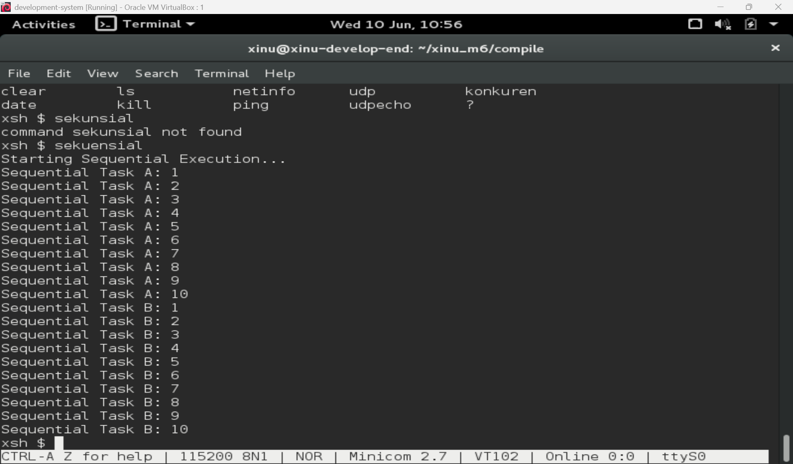
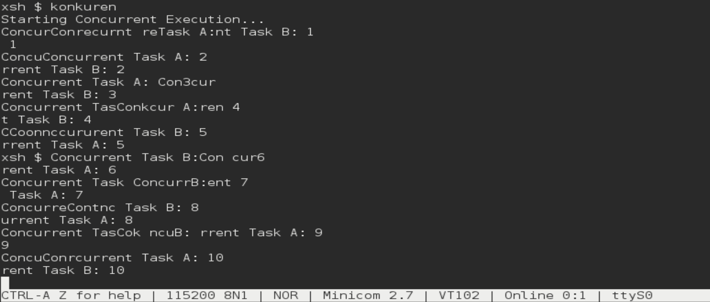
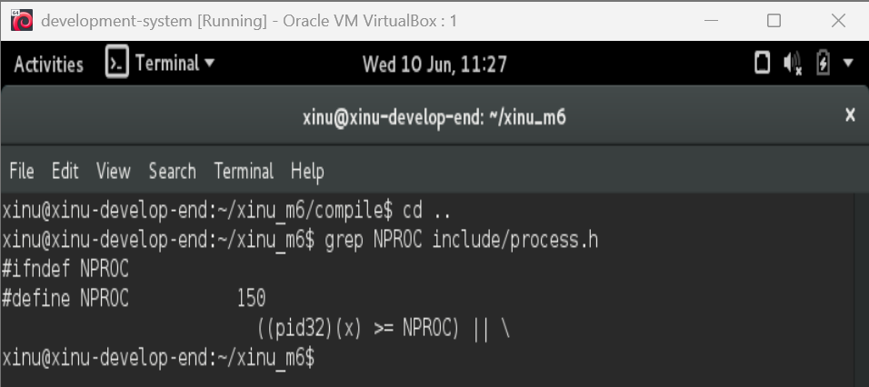
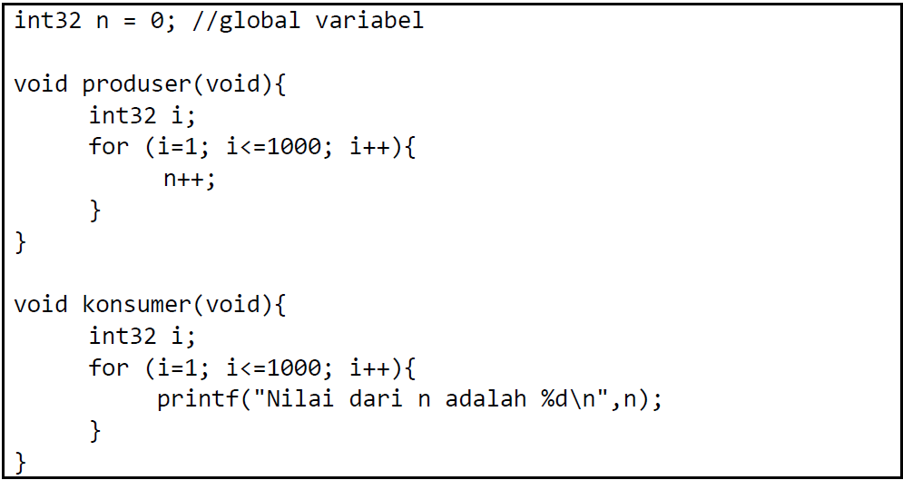

# <h1 align="center">Laporan Praktikum Modul 06 <br> Sekuensial dan Konkuren</h1>

<p align="center">Muhammad Rifqi Al Baqi Ananta - 2311104005</p>

## 📝 Dasar Teori

Dalam sistem operasi, terdapat dua pendekatan utama dalam menjalankan program, yaitu **sekuensial** dan **konkuren**. Program sekuensial dieksekusi secara berurutan, di mana setiap instruksi harus selesai terlebih dahulu sebelum instruksi berikutnya dijalankan. Pada suatu waktu hanya terdapat satu alur eksekusi yang aktif sehingga perilaku program relatif mudah diprediksi.

Sebaliknya, program konkuren memungkinkan beberapa proses berjalan secara bersamaan. Pada sistem dengan satu CPU, konkurensi dicapai melalui mekanisme **multitasking** yang dilakukan oleh scheduler sistem operasi. Scheduler akan membagi waktu CPU kepada beberapa proses secara bergantian dalam interval yang sangat singkat sehingga memberikan ilusi bahwa beberapa proses berjalan secara simultan. Pada sistem multicore, proses-proses tersebut bahkan dapat berjalan secara paralel.

Xinu menyediakan berbagai system call untuk mengelola proses, di antaranya `create()` untuk membuat proses baru dan `resume()` untuk mengaktifkan proses agar dapat dijadwalkan oleh CPU. Dengan memanfaatkan mekanisme tersebut, beberapa proses dapat dijalankan secara konkuren sehingga meningkatkan efisiensi penggunaan sumber daya sistem.

---

## 🛠️ Guided

Pada tahap guided dilakukan implementasi dan pengujian program sekuensial serta program konkuren pada sistem operasi Xinu. Tujuannya adalah memahami perbedaan perilaku eksekusi antara kedua pendekatan tersebut.

### Hasil Eksekusi Program Sekuensial

Pada program sekuensial, Task A dijalankan terlebih dahulu hingga selesai dari iterasi 1 sampai 10. Setelah Task A selesai, Task B baru dijalankan dari iterasi 1 sampai 10. Hasil ini menunjukkan bahwa proses dieksekusi secara berurutan tanpa adanya pergantian eksekusi antar task.



### Hasil Eksekusi Program Konkuren

Pada program konkuren, Task A dan Task B dijalankan sebagai proses yang berbeda menggunakan fungsi `create()` dan `resume()`. Output kedua task muncul secara berselang-seling karena scheduler Xinu membagi waktu CPU kepada kedua proses secara bergantian.



---

## 📖 Jurnal

### 1. Carilah pada source code Xinu yang memberi batasan mengenai banyaknya proses yang bisa dibuat! Berapa maksimal proses dalam Xinu? Ubah menjadi maksimal 150 proses!

**Jawab:**

Batas maksimum jumlah proses pada Xinu ditentukan oleh konstanta `NPROC` yang terdapat pada file `include/process.h`. Pada konfigurasi awal, nilai `NPROC` adalah 8 sehingga sistem hanya dapat menampung maksimal 8 proses secara bersamaan.

Untuk memenuhi kebutuhan soal, nilai tersebut diubah menjadi:

```c
#define NPROC 150
```

Dengan perubahan tersebut, sistem dapat menampung hingga 150 proses secara bersamaan setelah dilakukan proses kompilasi ulang.



---

### 2. Jalankan kode sekuensial!

**Jawab:**

Program sekuensial berhasil dijalankan menggunakan command `sekuensial`. Hasil menunjukkan bahwa seluruh Task A dieksekusi terlebih dahulu hingga selesai, kemudian dilanjutkan dengan seluruh Task B. Tidak terdapat pergantian eksekusi di antara kedua task tersebut sehingga urutan output tetap dan mudah diprediksi.


---

### 3. Jalankan kode konkuren!

**Jawab:**

Program konkuren berhasil dijalankan menggunakan command `konkuren`. Hasil menunjukkan bahwa output Task A dan Task B muncul secara bergantian. Hal ini terjadi karena kedua task dijalankan sebagai proses yang berbeda dan scheduler Xinu membagi waktu CPU secara bergantian kepada masing-masing proses.


---

### 4. Buatlah 2 proses produser dan konsumer. Produser memproduksi angka integer dari 1–1000. Konsumer mengkonsumsi integer yang diproduksi oleh produser dan menampilkannya!

**Jawab:**

Implementasi produser dan konsumer menggunakan sebuah variabel global bertipe `int32` bernama `n` yang digunakan secara bersama oleh kedua proses. Proses produser bertugas meningkatkan nilai `n` sebanyak 1000 kali, sedangkan proses konsumer membaca dan menampilkan nilai `n` secara berulang.



Hasil program tidak selalu sesuai dengan intuisi awal karena terjadi akses bersamaan terhadap variabel global `n` oleh proses produser dan konsumer. Produser bertugas menaikkan nilai `n` dari 0 hingga 1000, sedangkan konsumer secara bersamaan membaca dan menampilkan nilai tersebut.

Karena Xinu menggunakan mekanisme **preemptive scheduling**, sistem operasi dapat melakukan perpindahan eksekusi dari satu proses ke proses lain kapan saja. Akibatnya konsumer dapat membaca nilai `n` ketika produser belum selesai melakukan seluruh proses produksi.

Kondisi tersebut menyebabkan nilai yang ditampilkan konsumer tidak selalu berurutan dari 1 sampai 1000. Konsumer dapat mencetak nilai yang sama beberapa kali, melewati beberapa nilai, atau langsung menampilkan nilai yang besar tergantung kapan scheduler memberikan CPU kepada masing-masing proses.

Fenomena ini dikenal sebagai **race condition**, yaitu kondisi ketika beberapa proses mengakses sumber daya yang sama tanpa adanya mekanisme sinkronisasi seperti semaphore atau mutex. Oleh karena itu hasil yang diperoleh tidak selalu sesuai dengan ekspektasi awal meskipun program berjalan dengan benar.

---

## 📚 Referensi

1. Modul Praktikum Sistem Operasi Modul 06 – Sekuensial dan Konkuren, Telkom University Purwokerto.
2. Comer, D. E. (2015). *Operating System Design: The Xinu Approach*. CRC Press.
3. Silberschatz, A., Galvin, P. B., & Gagne, G. (2018). *Operating System Concepts* (10th Edition). Wiley.
