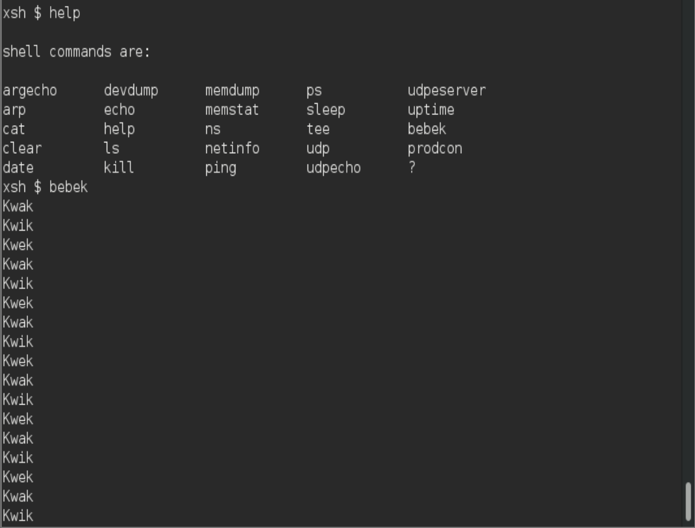
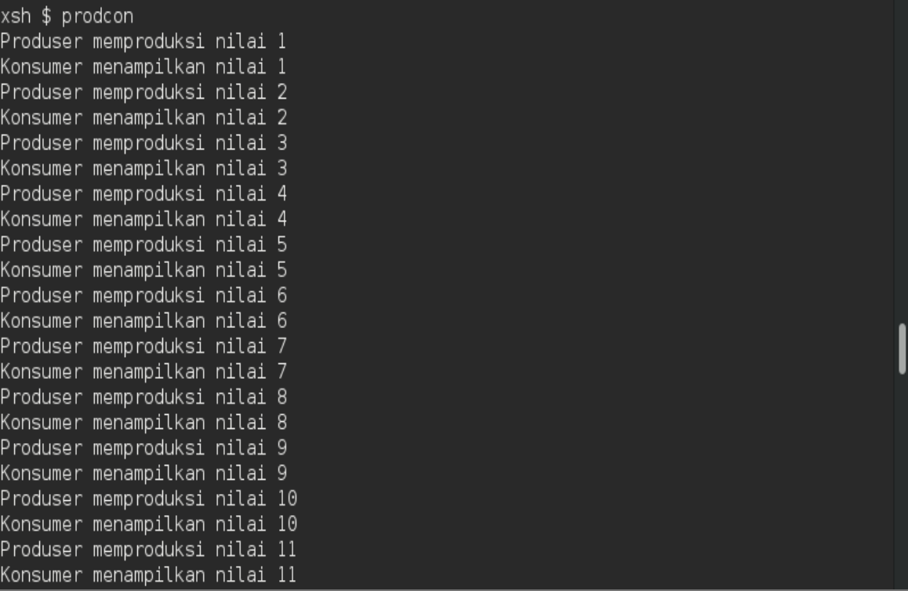

# <h1 align="center">Laporan Praktikum Modul 07 <br> Semaphore</h1>

<p align="center">Muhammad Rifqi Al Baqi Ananta - 2311104005</p>

## 📝 Dasar Teori

Semaphore merupakan mekanisme sinkronisasi yang digunakan dalam sistem operasi untuk mengatur akses beberapa proses terhadap sumber daya yang digunakan secara bersamaan. Semaphore bekerja menggunakan dua operasi utama yaitu `wait()` dan `signal()`. Operasi `wait()` digunakan untuk mengurangi nilai semaphore dan akan memblokir proses apabila resource belum tersedia, sedangkan operasi `signal()` digunakan untuk menambah nilai semaphore dan membangunkan proses yang sedang menunggu.

Pada sistem operasi Xinu, semaphore digunakan untuk mengimplementasikan berbagai pola sinkronisasi seperti **signaling** dan **mutex**. Pola signaling digunakan untuk mengatur urutan eksekusi antar proses sehingga proses tertentu hanya dapat berjalan setelah proses lain selesai. Sementara itu, mutex digunakan untuk menjamin bahwa hanya satu proses yang dapat mengakses critical section pada suatu waktu. Dengan penggunaan semaphore, masalah sinkronisasi seperti race condition dapat dihindari sehingga proses dapat berjalan secara teratur dan konsisten.

---

## 🛠️ Guided

Pada tahap guided dilakukan pengujian implementasi semaphore yang telah disediakan pada Modul 7. Pengujian dilakukan menggunakan command yang telah ditambahkan pada shell Xinu untuk memahami mekanisme sinkronisasi proses menggunakan semaphore.

### Implementasi Semaphore Menggunakan Command `bebek`

Command `bebek` digunakan untuk mengimplementasikan sinkronisasi tiga proses yang berjalan secara bergantian menggunakan semaphore. Melalui mekanisme signaling, setiap proses hanya dapat berjalan ketika semaphore yang sesuai telah diberikan sinyal oleh proses sebelumnya.



### Implementasi Producer-Consumer Menggunakan Command `prodcon`

Command `prodcon` digunakan untuk menunjukkan implementasi sinkronisasi antara proses produser dan konsumer menggunakan semaphore. Dengan adanya semaphore, proses konsumer hanya dapat membaca data setelah produser selesai menghasilkan data yang baru.



---

## 🛠️ Jurnal

### 1. Buatlah 3 buah proses yaitu P1, P2 dan P3. P1 selalu menampilkan “kwak”, P2 selalu menampilkan “kwik”, P3 selalu menampilkan “kwek”. Menggunakan 3 proses tersebut dan beberapa buah semaphore, buatlah program yang dapat menampilkan:

```text
Kwak
Kwik
Kwek
Kwak
Kwik
Kwek
...
```

**Jawab:**

Pada percobaan ini digunakan tiga proses yang masing-masing bertugas menampilkan kata **"Kwak"**, **"Kwik"**, dan **"Kwek"**. Untuk menjaga agar urutan keluaran tetap konsisten, digunakan beberapa semaphore sebagai mekanisme signaling antar proses.

Proses pertama akan menampilkan kata **"Kwak"**, kemudian memberikan sinyal kepada proses kedua untuk menampilkan **"Kwik"**. Setelah itu proses kedua memberikan sinyal kepada proses ketiga untuk menampilkan **"Kwek"**. Setelah proses ketiga selesai, semaphore akan mengaktifkan kembali proses pertama sehingga pola keluaran akan terus berulang.

Dengan penggunaan semaphore, urutan keluaran dapat dipastikan selalu menjadi:

```text
Kwak
Kwik
Kwek
```

tanpa terjadi pertukaran urutan akibat scheduler.


---

### 2. Buatlah proses bernama produser yang memproduksi bilangan 1–1000. Buatlah proses bernama konsumer yang akan menampilkan nilai yang diproduksi oleh produser. Gunakan semaphore!

Contoh output:

```text
Produser memproduksi nilai 1
Konsumer menampilkan nilai 1

Produser memproduksi nilai 2
Konsumer menampilkan nilai 2

...
```

**Jawab:**

Pada percobaan ini dibuat dua proses konkuren yaitu **produser** dan **konsumer**. Proses produser bertugas menghasilkan data berupa bilangan dari 1 hingga 1000, sedangkan proses konsumer bertugas membaca dan menampilkan nilai yang dihasilkan oleh produser.

Untuk memastikan kedua proses berjalan secara sinkron, digunakan semaphore sebagai mekanisme koordinasi. Setelah produser menghasilkan suatu nilai, semaphore akan memberikan sinyal kepada konsumer untuk membaca nilai tersebut. Setelah konsumer selesai menampilkan data, semaphore kembali memberikan sinyal kepada produser untuk menghasilkan data berikutnya.

Dengan mekanisme tersebut, setiap data yang diproduksi akan langsung dikonsumsi sebelum data baru diproduksi. Penggunaan semaphore berhasil mencegah terjadinya race condition dan memastikan bahwa data yang ditampilkan oleh konsumer selalu sesuai dengan data yang terakhir diproduksi oleh produser.


---

## 📚 Referensi

1. Modul Praktikum Sistem Operasi Modul 07 – Semaphore.
2. Comer, D. E. (2015). *Operating System Design: The Xinu Approach*. CRC Press.
3. Silberschatz, A., Galvin, P. B., & Gagne, G. (2018). *Operating System Concepts* (10th Edition). Wiley.
