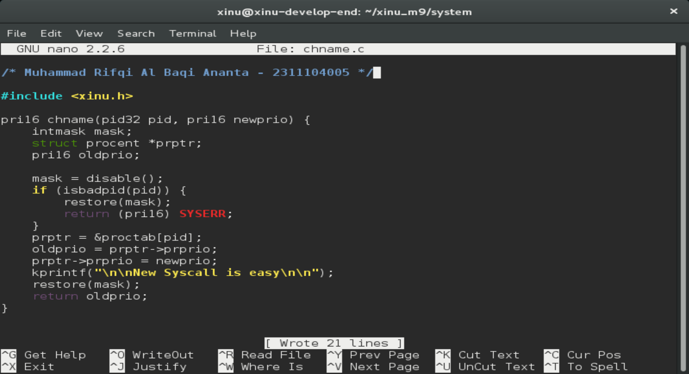
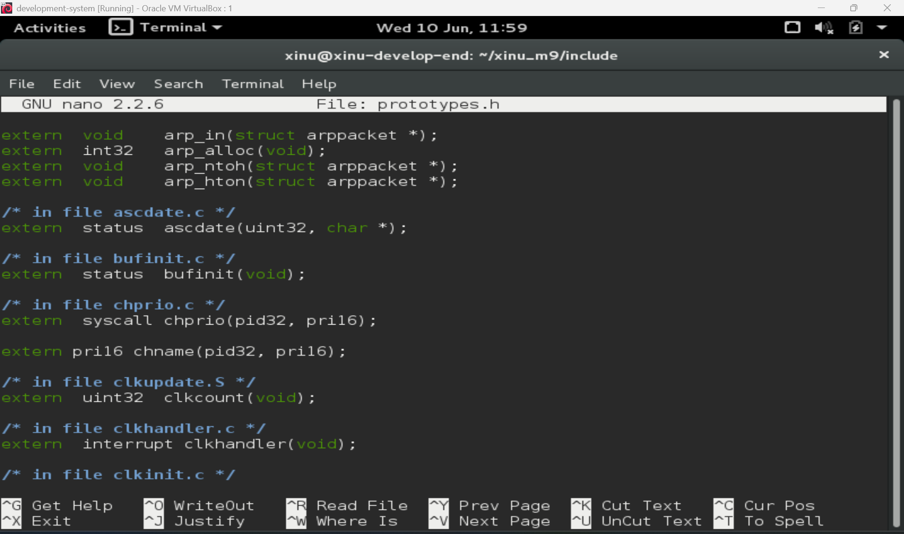
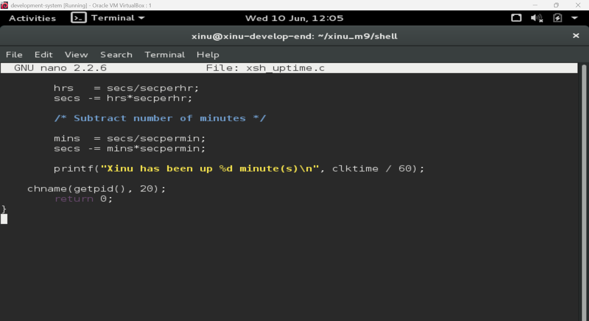
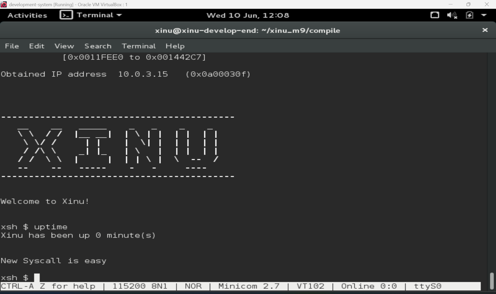
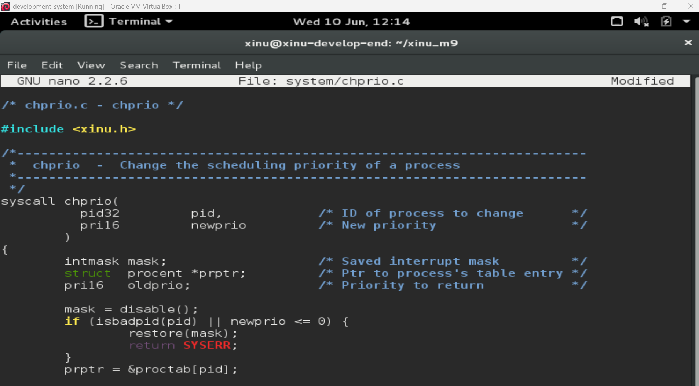
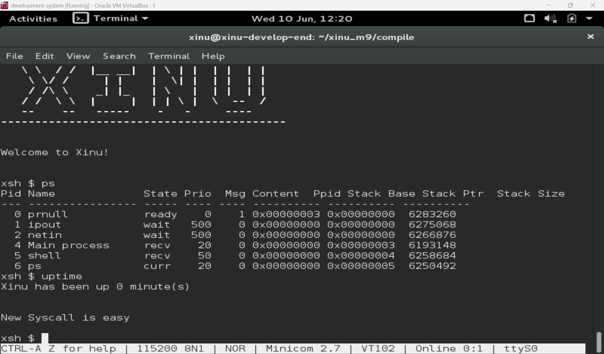
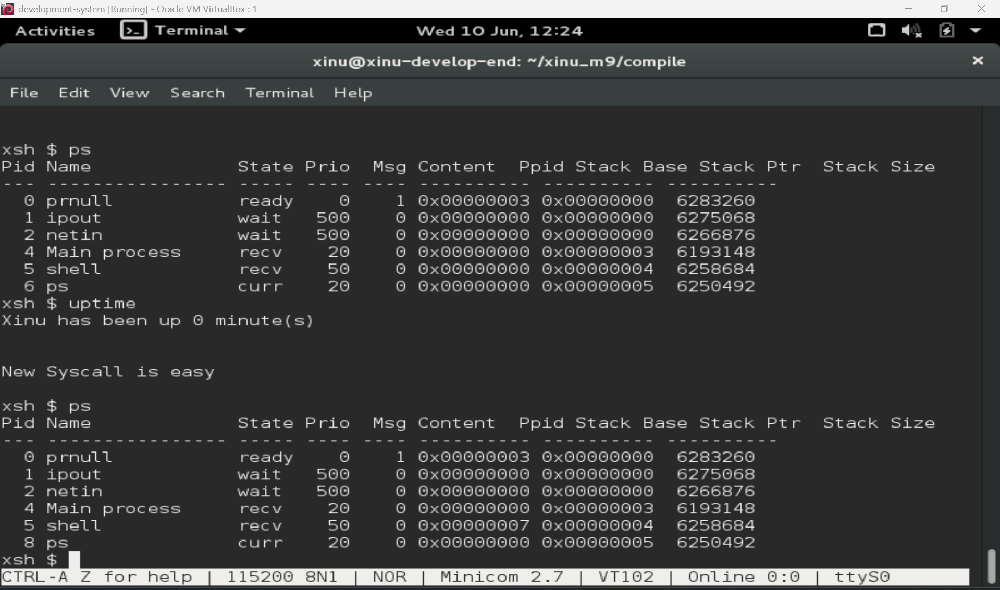

# <h1 align="center">Laporan Praktikum Modul 09 <br> Syscall Xinu</h1>

<p align="center">Muhammad Rifqi Al Baqi Ananta - 2311104005</p>

## 📝 Dasar Teori

System Call (Syscall) merupakan antarmuka yang disediakan oleh sistem operasi agar program pengguna dapat meminta layanan dari kernel secara aman. Melalui syscall, proses tidak perlu mengetahui implementasi internal sistem operasi karena seluruh mekanisme pengelolaan sumber daya dilakukan oleh kernel.

Pada Xinu, setiap syscall memiliki pola yang sama yaitu melakukan validasi parameter, menonaktifkan interupsi untuk menjaga konsistensi data, menjalankan layanan yang diminta, kemudian mengaktifkan kembali interupsi sebelum mengembalikan nilai ke proses pemanggil. Dengan mekanisme tersebut, integritas data sistem dapat terjaga dan proses pengguna dapat berinteraksi dengan kernel secara terkontrol.

Selain menggunakan syscall bawaan, Xinu juga memungkinkan pengguna membuat syscall baru dengan menambahkan file pada folder `system`, mendeklarasikan prototipe fungsi pada `include/prototypes.h`, kemudian mengompilasi ulang sistem. Syscall yang dibuat dapat dipanggil dari command shell maupun fungsi lain di dalam kernel.

---

## 🛠️ Guided

Pada tahap guided dilakukan implementasi syscall baru bernama `chname()` sesuai petunjuk pada Modul 9. Syscall tersebut dibuat dengan menyalin template syscall Xinu kemudian menambahkan fungsi untuk menampilkan pesan **"New Syscall is easy"** saat dieksekusi.

### Implementasi Syscall Baru `chname()`

File syscall baru dibuat pada folder `system/chname.c` dan mengikuti template standar syscall Xinu.



### Penambahan Prototype Syscall

Agar syscall dapat dikenali secara global oleh sistem, dilakukan penambahan deklarasi fungsi pada file `include/prototypes.h`.



### Penggunaan Syscall Pada Command `uptime`

Syscall `chname()` kemudian dipanggil dari command `uptime` sehingga setiap kali command tersebut dijalankan akan muncul pesan dari syscall yang telah dibuat.



### Hasil Pengujian Syscall

Setelah proses kompilasi berhasil dilakukan, command `uptime` dijalankan dan menampilkan output tambahan berupa pesan dari syscall yang telah dibuat.



---

## 🛠️ Jurnal

### 1. Buatlah syscall baru bernama `chname()` kemudian panggil syscall tersebut dari command `uptime`.

**Jawab:**

Pada percobaan ini dibuat syscall baru bernama `chname()` dengan mengikuti template syscall Xinu. Fungsi tersebut diletakkan pada file `system/chname.c` dan didaftarkan pada file `include/prototypes.h` agar dapat digunakan oleh seluruh sistem.

Setelah syscall berhasil dibuat, command `uptime` dimodifikasi dengan menambahkan pemanggilan fungsi `chname(getpid(),20);` sebelum fungsi mengembalikan nilai. Tujuannya adalah untuk membuktikan bahwa syscall yang dibuat dapat dipanggil dari command shell Xinu.

Hasil pengujian menunjukkan bahwa setiap kali command `uptime` dijalankan, sistem menampilkan pesan:

```text
New Syscall is easy
```

Hal ini membuktikan bahwa syscall berhasil dibuat, berhasil didaftarkan pada sistem, dan berhasil dipanggil dari command `uptime`.


---

### 2. Modifikasi syscall `chprio()` agar menolak prioritas bernilai negatif atau nol.

**Jawab:**

Pada percobaan ini dilakukan modifikasi terhadap syscall `chprio()` yang berfungsi mengubah prioritas proses. Secara default, syscall hanya memeriksa validitas PID yang diberikan. Untuk meningkatkan validasi parameter, ditambahkan pengecekan agar nilai prioritas baru (`newprio`) tidak boleh bernilai negatif maupun nol.

Kode yang ditambahkan adalah:

```c
if (isbadpid(pid) || newprio <= 0) {
    restore(mask);
    return SYSERR;
}
```

Dengan penambahan kondisi tersebut, syscall akan langsung mengembalikan nilai `SYSERR` apabila pengguna mencoba memberikan prioritas bernilai nol atau negatif.

Hasil implementasi ditunjukkan pada gambar berikut.



---

### 3. Uji syscall hasil modifikasi dengan memberikan PID tidak valid dan prioritas negatif.

**Jawab:**

Pengujian dilakukan dengan memanggil syscall `chprio()` melalui command `uptime` menggunakan parameter yang tidak valid, yaitu:

```c
chprio(5,-3);
```

Parameter di atas menggunakan prioritas negatif sehingga seharusnya ditolak oleh syscall. Setelah sistem dikompilasi ulang dan command `uptime` dijalankan, prioritas proses diperiksa menggunakan command `ps`.

Hasil pengujian menunjukkan bahwa prioritas proses tetap tidak berubah setelah syscall dipanggil. Hal ini membuktikan bahwa validasi `newprio <= 0` bekerja dengan baik dan syscall mengembalikan `SYSERR`.

Selain itu dilakukan pengujian menggunakan PID yang tidak valid (melebihi jumlah proses maksimum Xinu). Hasil pengujian juga menunjukkan bahwa prioritas proses tidak berubah karena parameter PID ditolak oleh fungsi `isbadpid()`.

Dengan demikian dapat disimpulkan bahwa syscall `chprio()` yang telah dimodifikasi berhasil melakukan validasi terhadap dua kondisi kesalahan yaitu:

1. PID tidak valid.
2. Prioritas bernilai negatif atau nol.

Berikut hasil pengujian yang dilakukan.

**Kondisi awal sebelum pemanggilan syscall**



**Kondisi setelah syscall dijalankan**



Berdasarkan hasil tersebut, prioritas proses tetap sama sehingga modifikasi pada syscall berhasil mencegah perubahan prioritas yang tidak valid.

---

## 📚 Referensi

1. Modul Praktikum Sistem Operasi Modul 09 – Syscall Xinu.
2. Comer, D. E. (2015). *Operating System Design: The Xinu Approach*. CRC Press.
3. Silberschatz, A., Galvin, P. B., & Gagne, G. (2018). *Operating System Concepts* (10th Edition). Wiley.