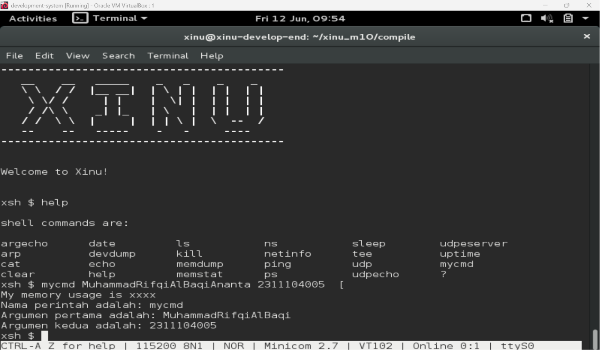
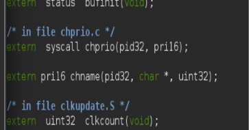
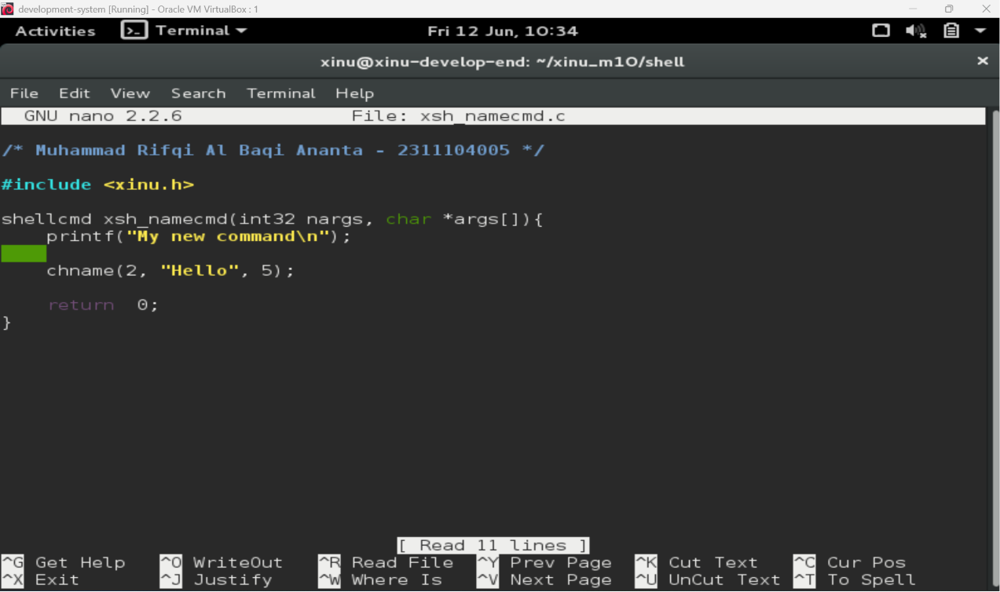
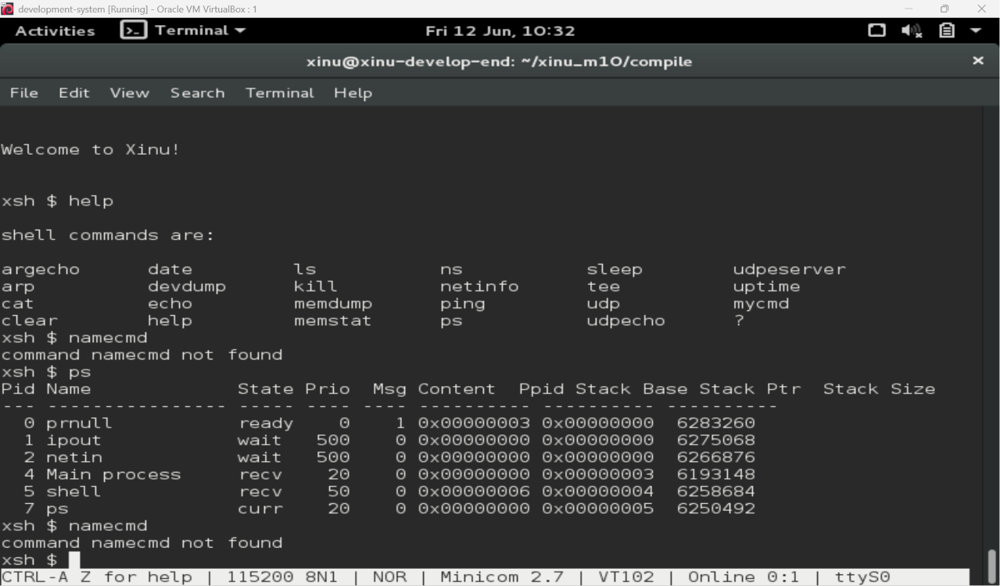

# <h1 align="center">Laporan Praktikum Modul 10   Shell</h1>

Muhammad Rifqi Al Baqi Ananta - 2311104005

## Dasar Teori

Shell merupakan program yang berfungsi sebagai antarmuka antara pengguna dengan sistem operasi. Melalui shell, pengguna dapat memberikan perintah yang kemudian diproses dan dieksekusi oleh sistem operasi. Pada Xinu, shell bekerja dengan cara membaca input dari pengguna secara terus menerus, kemudian melakukan parsing terhadap perintah yang diberikan untuk menentukan fungsi yang akan dijalankan.

Setiap command pada shell Xinu terdaftar pada tabel command (`cmdtab`) yang berada pada file `shell.c`. Ketika pengguna memasukkan sebuah perintah, shell akan mencocokkan nama command tersebut dengan entri yang tersedia pada tabel command. Jika ditemukan kecocokan, shell akan menjalankan fungsi yang terkait dengan command tersebut.

Penambahan command baru pada Xinu dilakukan dengan membuat file implementasi command pada folder `shell`, menambahkan prototype fungsi pada file `shprototypes.h`, serta mendaftarkan command tersebut pada tabel command di file `shell.c`. Setelah seluruh perubahan selesai dilakukan, sistem harus dikompilasi ulang agar command baru dapat dikenali dan dijalankan oleh shell Xinu.

---

## Guided

Pada tahap guided dilakukan implementasi command baru pada shell Xinu berdasarkan langkah-langkah yang diberikan pada modul praktikum. Setelah proses kompilasi berhasil dilakukan, command dapat dijalankan melalui shell dan menerima argumen yang diberikan oleh pengguna.

---

## Jurnal

### Nomor 1

Pada percobaan ini dilakukan modifikasi syscall `chname()` dengan mengubah prototype fungsi pada file `prototypes.h` agar dapat menerima parameter berupa PID proses, nama baru proses, dan panjang nama yang akan digunakan. Modifikasi ini diperlukan agar syscall dapat digunakan untuk mengubah nama proses yang sedang berjalan maupun proses lain yang terdapat pada tabel proses Xinu.

---

### Nomor 2 dan 3

Pada percobaan ini dibuat command baru bernama `namecmd` yang akan memanggil syscall `chname()` untuk mengubah nama proses tertentu. Implementasi command dilakukan dengan membuat file `xsh_namecmd.c` pada folder `shell` dan menambahkan logika pemanggilan syscall yang telah dimodifikasi sebelumnya.

Setelah command berhasil ditambahkan dan sistem dikompilasi ulang, dilakukan pengujian menggunakan shell Xinu. Hasil pengujian menunjukkan bahwa command telah dikenali oleh sistem, meskipun pada percobaan ini command belum berhasil dijalankan karena masih terdapat kesalahan pada proses registrasi command di tabel shell sehingga shell menampilkan pesan `command namecmd not found`.

---

## Kesimpulan

Pada praktikum ini telah dipelajari mekanisme kerja shell pada sistem operasi Xinu serta proses penambahan command baru ke dalam shell. Selain itu dilakukan modifikasi syscall `chname()` agar dapat digunakan untuk mengubah nama proses berdasarkan PID dan nama baru yang diberikan. Proses penambahan command memerlukan perubahan pada file prototype, implementasi command, serta registrasi command pada tabel shell. Setelah seluruh perubahan dilakukan, sistem harus dikompilasi ulang agar command baru dapat dikenali oleh shell Xinu.
