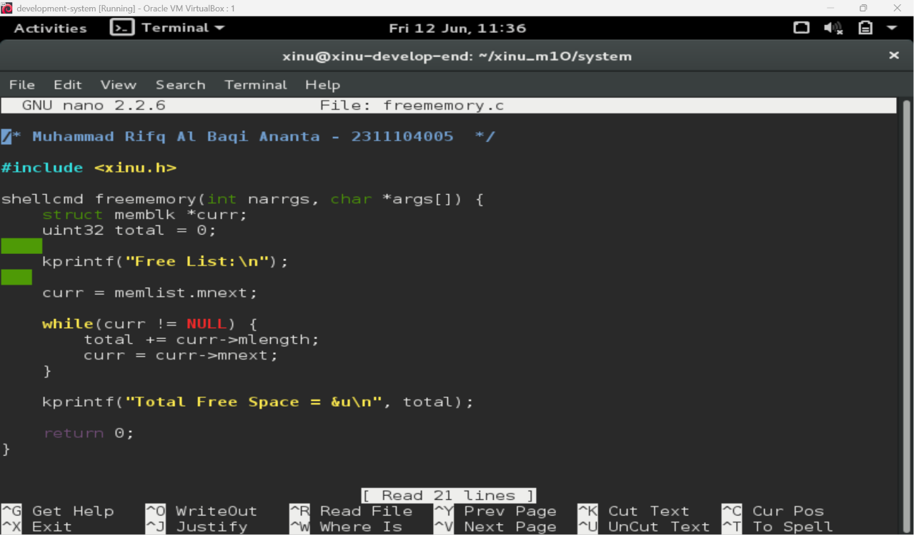
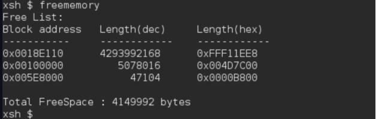

# <h1 align="center">Laporan Praktikum Modul 11   Memori Xinu</h1>

Muhammad Rifqi Al Baqi Ananta - 2311104005

## 📝 Dasar Teori

Memori merupakan salah satu komponen utama dalam sistem operasi yang digunakan untuk menyimpan instruksi program dan data selama proses berjalan. Pada sistem operasi Xinu, memori dibagi menjadi beberapa bagian yaitu **text segment**, **data segment**, **BSS segment**, **heap**, dan **stack**. Text segment digunakan untuk menyimpan kode program yang telah dikompilasi, data segment digunakan untuk menyimpan variabel global yang telah diinisialisasi, sedangkan BSS segment digunakan untuk menyimpan variabel global yang belum diinisialisasi.

Selain itu, Xinu menyediakan mekanisme manajemen memori dinamis menggunakan **heap** dan **free memory list**. Heap digunakan untuk alokasi memori secara dinamis ketika program sedang berjalan. Setiap blok memori yang tidak digunakan akan dicatat dalam free memory list menggunakan struktur linked list sehingga sistem dapat mengelola proses alokasi dan dealokasi memori dengan lebih efisien.

Manajemen memori yang baik sangat penting untuk menjaga efisiensi penggunaan sumber daya sistem. Dengan memahami bagaimana Xinu mengelola free memory block, praktikan dapat memahami proses alokasi, dealokasi, serta pemanfaatan memori yang tersedia pada sistem operasi.

---

## 🛠️ Guided

Pada Modul 11 praktikan mempelajari konsep manajemen memori pada sistem operasi Xinu. Xinu membagi memori ke dalam beberapa segmen yaitu text segment, data segment, BSS segment, heap, dan stack. Setiap segmen memiliki fungsi yang berbeda dalam menyimpan instruksi program maupun data yang digunakan selama sistem berjalan.

Selain memahami struktur memori, praktikan juga mempelajari mekanisme alokasi dan dealokasi memori dinamis menggunakan heap. Xinu menyediakan fungsi-fungsi seperti `getmem()` dan `freemem()` untuk melakukan pengelolaan memori secara dinamis. Setiap blok memori yang tidak digunakan akan dicatat dalam free memory list sehingga dapat digunakan kembali ketika terdapat permintaan alokasi memori baru.

Pada implementasinya, Xinu menggunakan struktur linked list untuk menyimpan informasi seluruh blok memori kosong. Setiap node pada linked list menyimpan alamat awal blok memori, ukuran blok, dan pointer menuju blok kosong berikutnya. Dengan mekanisme ini, sistem dapat melakukan pencarian, alokasi, maupun penggabungan blok memori kosong secara efisien.

Melalui praktikum ini, praktikan mempelajari bagaimana Xinu mengelola free memory list serta bagaimana perubahan ukuran free space dapat diamati ketika terjadi proses alokasi dan dealokasi memori. Pemahaman terhadap mekanisme ini sangat penting karena menjadi dasar pengelolaan sumber daya memori pada sistem operasi.

---

## 🛠️ Jurnal

### 1. Membuat Command `freememory`

Pada percobaan ini dibuat command baru bernama **freememory** yang berfungsi untuk menampilkan informasi free memory yang tersedia pada sistem. Command ini melakukan traversal terhadap free memory list menggunakan pointer `memlist.mnext`, kemudian menjumlahkan seluruh ukuran blok memori kosong untuk memperoleh total free space yang tersedia.

Implementasi dilakukan dengan membuat file `freememory.c` dan memanfaatkan struktur `memblk` yang digunakan Xinu untuk menyimpan daftar blok memori kosong.

#### Implementasi Program

#### Hasil Pengujian

Setelah proses kompilasi berhasil dilakukan, command `freememory` dapat dijalankan melalui shell Xinu. Program berhasil menampilkan daftar free memory block beserta ukuran masing-masing blok dan total free space yang masih tersedia pada sistem.

#### Analisis

Berdasarkan hasil pengujian, command `freememory` berhasil membaca seluruh blok memori kosong yang tersimpan pada free memory list. Setiap blok menampilkan alamat memori, ukuran dalam bentuk desimal, serta ukuran dalam bentuk hexadecimal. Program juga berhasil menghitung total free space sebesar **4.149.992 bytes** yang menunjukkan jumlah memori kosong yang masih dapat digunakan oleh sistem.

---

### 2. Jawaban Pertanyaan Teori

#### a. Mengapa Xinu memisahkan data segment dan BSS segment?

Xinu memisahkan data segment dan BSS segment untuk meningkatkan efisiensi penggunaan memori. Data segment digunakan untuk menyimpan variabel global atau static yang telah diinisialisasi, sedangkan BSS segment digunakan untuk menyimpan variabel yang belum diinisialisasi. Dengan pemisahan ini, variabel pada BSS tidak perlu disimpan secara penuh pada file executable sehingga ukuran program menjadi lebih kecil.

#### b. Bagaimana alokasi dan dealokasi memori selama eksekusi memengaruhi ukuran free space?

Ketika memori dialokasikan kepada suatu proses, ukuran free space akan berkurang karena sebagian memori digunakan oleh proses tersebut. Sebaliknya, ketika memori dibebaskan melalui proses dealokasi, blok memori akan dikembalikan ke free memory list sehingga ukuran free space akan bertambah kembali.

#### c. Mengapa penggunaan heap lebih berpotensi menimbulkan masalah dibandingkan stack?

Heap lebih berpotensi menimbulkan masalah karena pengelolaannya dilakukan secara manual oleh programmer. Kesalahan dalam proses alokasi atau dealokasi dapat menyebabkan memory leak, dangling pointer, maupun fragmentasi memori. Stack lebih aman karena pengelolaannya dilakukan secara otomatis oleh sistem.

#### d. Mengapa Xinu menggunakan struktur linked list untuk menyimpan free block?

Linked list memungkinkan sistem menambah, menghapus, dan menggabungkan blok memori kosong secara dinamis tanpa memerlukan ukuran penyimpanan yang tetap. Struktur ini sangat sesuai untuk pengelolaan free memory karena ukuran dan jumlah blok memori kosong dapat berubah selama sistem berjalan.

#### e. Apa tantangan utama dalam penggunaan heap di Xinu?

Tantangan utama dalam penggunaan heap adalah fragmentasi memori. Fragmentasi terjadi ketika memori kosong terpecah menjadi banyak blok kecil akibat proses alokasi dan dealokasi yang berulang. Kondisi ini dapat menyebabkan sistem kesulitan menyediakan blok memori yang cukup besar meskipun total memori kosong masih tersedia.

---

## 📚 Referensi

1. Modul Praktikum Sistem Operasi Modul 11 – Memori Xinu.
2. Comer, D. E. (2015). *Operating System Design: The Xinu Approach*. CRC Press.
3. Silberschatz, A., Galvin, P. B., & Gagne, G. (2018). *Operating System Concepts* (10th Edition). Wiley.
