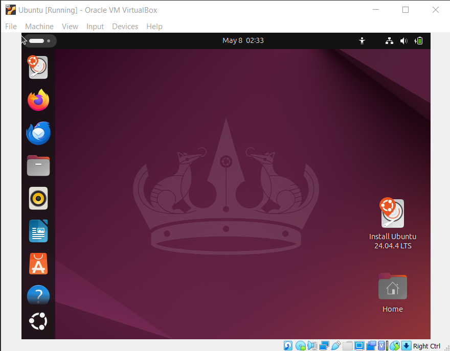
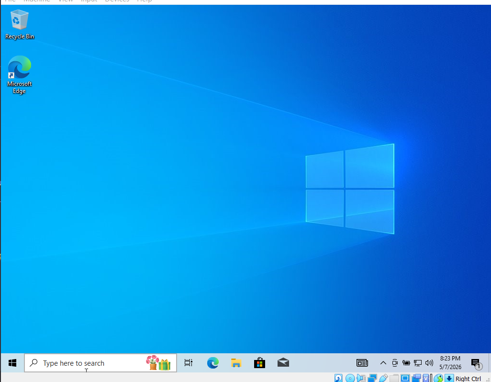

# <h1 align="center">Laporan Praktikum Modul XII   Linux dan Windows</h1>

Muhammad Rifqi Al Baqi Ananta - 2311104005

## 📝 Dasar Teori

Sistem operasi merupakan perangkat lunak yang berfungsi sebagai penghubung antara pengguna dengan perangkat keras komputer. Sistem operasi bertanggung jawab dalam mengatur penggunaan sumber daya komputer seperti prosesor, memori, media penyimpanan, serta perangkat input dan output agar dapat digunakan secara efisien. Selain itu, sistem operasi juga menyediakan berbagai layanan yang memungkinkan aplikasi dapat dijalankan dengan baik.

Linux merupakan salah satu sistem operasi berbasis open-source yang dikembangkan pertama kali oleh Linus Torvalds. Linux banyak digunakan pada server, komputer pribadi, maupun perangkat embedded karena memiliki tingkat keamanan, stabilitas, dan fleksibilitas yang tinggi. Salah satu distribusi Linux yang paling populer adalah Ubuntu.

Windows merupakan sistem operasi yang dikembangkan oleh Microsoft dan menjadi salah satu sistem operasi yang paling banyak digunakan di dunia. Windows menyediakan antarmuka grafis (GUI) yang mudah digunakan sehingga cocok bagi pengguna umum maupun profesional. Selain itu, Windows memiliki dukungan aplikasi dan perangkat keras yang sangat luas.

Melalui praktikum ini, mahasiswa diperkenalkan pada penggunaan sistem operasi Linux dan Windows menggunakan VirtualBox sebagai media virtualisasi sehingga dapat memahami karakteristik serta perbedaan kedua sistem operasi tersebut.

---

## 🛠️ Guided

### Menjalankan Ubuntu pada VirtualBox

Pada tahap ini dilakukan instalasi dan pengujian sistem operasi Ubuntu pada VirtualBox. Setelah proses instalasi selesai, Ubuntu berhasil dijalankan dan menampilkan desktop utama sistem operasi.

Tampilan di atas menunjukkan bahwa Ubuntu 24.04.4 LTS berhasil dijalankan pada VirtualBox dan siap digunakan untuk kegiatan praktikum.

---

### Menjalankan Windows pada VirtualBox

Selanjutnya dilakukan instalasi dan pengujian sistem operasi Windows pada VirtualBox. Setelah proses instalasi selesai, Windows berhasil menampilkan desktop utama sistem operasi.

Tampilan di atas menunjukkan bahwa Windows berhasil dijalankan pada VirtualBox dan dapat digunakan untuk menjalankan berbagai aplikasi maupun kebutuhan praktikum.

---

## 🛠️ Jurnal

### 1. Jelaskan dengan bahasa sendiri, apa itu Sistem Operasi?

**Jawab:**

Sistem operasi adalah perangkat lunak utama yang berfungsi mengelola seluruh sumber daya komputer dan menjadi penghubung antara pengguna dengan perangkat keras. Sistem operasi mengatur penggunaan CPU, memori, penyimpanan, serta perangkat input dan output sehingga aplikasi dapat berjalan dengan baik dan pengguna dapat berinteraksi dengan komputer secara mudah.

---

### 2. Buka dxdiag pada kolom search Windows dan jawab pertanyaan berikut!

**Jawab:**

a. Windows yang diinstal adalah **Windows 10**.

b. Arsitektur Windows yang digunakan adalah **64-bit**.

c. Kecepatan prosesor yang digunakan sekitar **2.1 GHz**.

d. Versi grafik yang digunakan adalah **DirectX 12**. Versi tersebut sudah memenuhi bahkan melebihi spesifikasi minimum yang umumnya direkomendasikan pada modul.

---

### 3. Apa kelebihan dari Windows yang terpasang sekarang? Sebutkan versi Windows terbaru saat ini!

**Jawab:**

Windows 10 memiliki berbagai kelebihan, antara lain:

* Antarmuka yang mudah digunakan dan ramah pengguna.
* Kompatibilitas aplikasi yang sangat luas.
* Dukungan driver perangkat keras yang lengkap.
* Memiliki fitur keamanan yang baik.
* Mendukung multitasking dengan optimal.

Versi Windows terbaru saat ini adalah **Windows 11**.

---

### 4. Buka VirtualBox dan jawab pertanyaan berikut!

**Jawab:**

a. Linux yang diinstal adalah **Ubuntu 24.04.4 LTS**.

b. Ubuntu yang digunakan memiliki arsitektur **64-bit**.

c. Kapasitas hard disk virtual yang digunakan adalah **15 GB**.

d. Jumlah partisi pada hard disk virtual adalah **2 partisi**.

---

### 5. Linux memiliki berbagai jenis, sebutkan 5 jenis Linux distro!

**Jawab:**

1. Ubuntu
2. Debian
3. Fedora
4. Kali Linux
5. Arch Linux

---

### 6. Anda sudah mengenal dan menggunakan 3 jenis sistem operasi pada praktikum ini, sebutkan sistem operasi tersebut!

**Jawab:**

1. Xinu
2. Linux (Ubuntu)
3. Windows

---

### 7. Setelah mengenal 3 jenis sistem operasi tersebut, menurut Anda sistem operasi mana yang lebih mudah digunakan? Jelaskan argumentasi Anda!

**Jawab:**

Menurut saya, Windows merupakan sistem operasi yang paling mudah digunakan karena memiliki antarmuka grafis yang intuitif dan mudah dipahami oleh pengguna. Hampir semua aktivitas dapat dilakukan melalui menu dan tampilan visual tanpa harus menggunakan command line. Selain itu, Windows memiliki kompatibilitas aplikasi yang sangat luas sehingga memudahkan pengguna dalam menjalankan berbagai kebutuhan sehari-hari maupun pekerjaan. Dukungan perangkat keras yang lengkap juga membuat proses instalasi dan penggunaan menjadi lebih praktis dibandingkan sistem operasi lainnya.

---

## 📚 Referensi

1. Modul Praktikum Sistem Operasi Modul 12 – Linux dan Windows.
2. Silberschatz, A., Galvin, P. B., & Gagne, G. (2018). *Operating System Concepts* (10th Edition). Wiley.
3. Stallings, W. (2018). *Operating Systems: Internals and Design Principles* (9th Edition). Pearson.
4. Ubuntu Documentation. (2025). *Ubuntu Desktop Guide*.
5. Microsoft Documentation. (2025). *Windows 10 Documentation*.
