# <h1 align="center">Laporan Praktikum Modul XIII <br> Perintah Dasar Linux</h1>

<p align="center">Muhammad Rifqi Al Baqi Ananta - 2311104005</p>

---

# 📝 Dasar Teori

### 1. Linux dan Terminal

Linux merupakan sistem operasi berbasis Unix yang bersifat open-source dan banyak digunakan pada komputer pribadi, server, maupun sistem embedded. Salah satu keunggulan Linux adalah kemampuannya untuk dikendalikan melalui Command Line Interface (CLI) menggunakan aplikasi terminal. Melalui terminal, pengguna dapat berinteraksi langsung dengan sistem operasi menggunakan berbagai perintah untuk mengelola file, direktori, proses, maupun konfigurasi sistem.

Setiap perintah Linux umumnya terdiri atas nama perintah, opsi (*option*), dan parameter (*argument*). Linux juga menerapkan konsep *case-sensitive* sehingga perbedaan huruf besar dan huruf kecil akan dianggap sebagai perintah atau nama file yang berbeda.

### 2. Manajemen File dan Direktori

Sistem file Linux tersusun secara hierarkis dengan direktori root (`/`) sebagai tingkat tertinggi. Untuk melakukan navigasi dan pengelolaan file, Linux menyediakan berbagai perintah dasar seperti `ls`, `cd`, `pwd`, `mkdir`, `cp`, `mv`, dan `rm`. Perintah-perintah tersebut memungkinkan pengguna untuk melihat isi direktori, berpindah lokasi, membuat folder baru, menyalin file, memindahkan file, hingga menghapus file atau direktori.

Pemahaman terhadap perintah-perintah dasar ini sangat penting karena menjadi fondasi dalam administrasi sistem Linux maupun pengembangan perangkat lunak di lingkungan berbasis Unix.

### 3. Pipeline dan Redirection

Linux menyediakan mekanisme *pipeline* dan *redirection* untuk meningkatkan efisiensi pemrosesan data melalui terminal. Pipeline menggunakan simbol (`|`) untuk menghubungkan output suatu perintah sebagai input bagi perintah berikutnya. Sementara itu, redirection digunakan untuk mengalihkan input atau output ke file tertentu menggunakan simbol seperti (`>`), (`>>`), dan (`<`).

Fitur ini memungkinkan pengguna melakukan pemrosesan data secara lebih fleksibel tanpa harus membuat program tambahan.

### 4. GNU Compiler Collection (GCC)

GNU Compiler Collection (GCC) adalah perangkat lunak compiler yang digunakan untuk menerjemahkan kode sumber menjadi program yang dapat dijalankan oleh sistem operasi. GCC mendukung berbagai bahasa pemrograman seperti C, C++, dan lainnya. Pada sistem Linux, proses kompilasi program C umumnya dilakukan menggunakan perintah:

```bash
gcc namafile.c -o program
```

Setelah proses kompilasi berhasil, program dapat dijalankan melalui terminal. GCC menjadi salah satu tools utama dalam pengembangan perangkat lunak pada sistem operasi Linux karena bersifat gratis, stabil, dan mendukung berbagai platform.

---

# 🛠️ Guided

Pada praktikum Modul 13, mahasiswa mempelajari berbagai perintah dasar Linux yang digunakan untuk melakukan navigasi direktori, manajemen file, penggunaan manual command, pipeline, redirection, serta kompilasi program menggunakan GCC. Penggunaan terminal menjadi fokus utama karena sebagian besar administrasi sistem Linux dilakukan melalui Command Line Interface (CLI).

Dokumentasi guided praktikum ditunjukkan pada gambar berikut.


---

# 🛠️ Jurnal

## Soal 1

### Jawaban

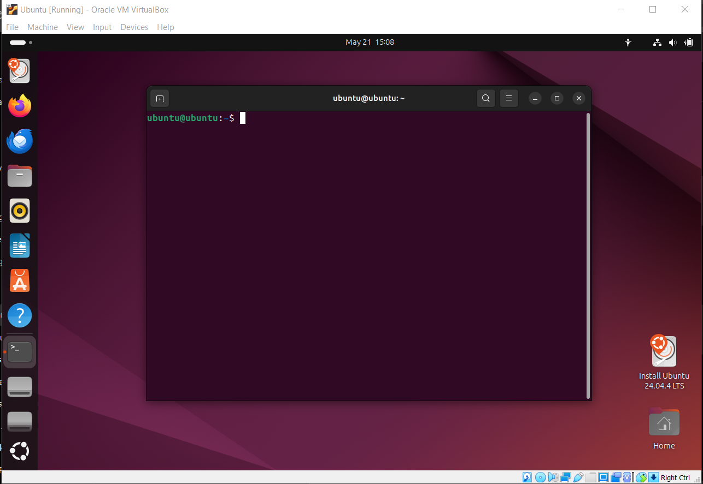

#### Penjelasan

* `ubuntu` pertama menunjukkan nama pengguna (*username*).
* `ubuntu` kedua menunjukkan nama komputer (*hostname*).
* Simbol `~` menunjukkan direktori home pengguna.
* Simbol `$` menunjukkan bahwa pengguna sedang berada pada mode user biasa.

---

## Soal 2

### Jawaban


Tidak terdapat option maupun parameter pada perintah `ls`.

Perintah `ls` digunakan untuk menampilkan isi direktori aktif saat ini.

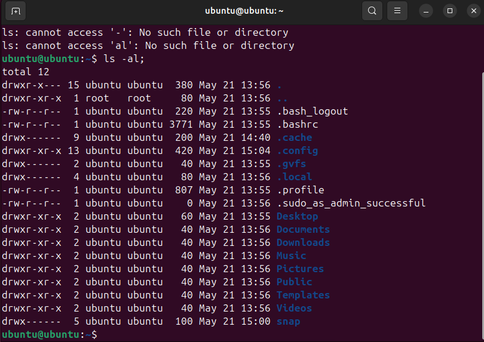

Option yang digunakan adalah:

```text
-al
```

Parameter yang digunakan adalah:

```text
/
```

Perintah tersebut digunakan untuk menampilkan seluruh isi direktori root secara detail termasuk file tersembunyi.

Perbedaan hasil kedua perintah adalah:

* `ls` menampilkan isi direktori aktif.
* `ls -al /` menampilkan isi direktori root secara detail.

---

## Soal 3

### Jawaban

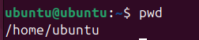

Perintah `pwd` tidak menggunakan option maupun parameter.

Fungsi perintah `pwd` adalah menampilkan lokasi direktori aktif saat ini.

---

## Soal 4

### Jawaban


Perintah:

```bash
cd /
```

tidak menggunakan option dan menggunakan parameter `/`.

Fungsinya adalah berpindah ke root directory.

---

## Soal 5

### Jawaban


Perintah:

```bash
cd /
cd ~
```

digunakan untuk berpindah ke root directory kemudian kembali ke home directory.

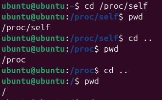

Perintah tersebut melakukan perpindahan direktori sebanyak tiga kali.

---

## Soal 6

### Jawaban

#### Copy file `/proc/cpuinfo`


#### Verifikasi file berhasil dicopy

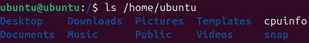

#### Copy file `/proc/uptime`

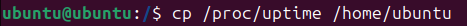

#### Verifikasi file berhasil dicopy


#### Menghapus file `uptime`


#### Verifikasi file berhasil dihapus

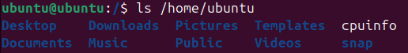

#### Rename file `cpuinfo` menjadi `infocpu`

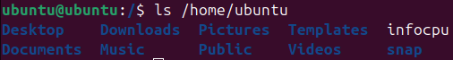

---

## Soal 7

### Jawaban

#### Membuat folder NIM


#### Membuat folder nama di dalam folder NIM

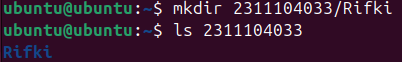

---

## Soal 8

### Jawaban

#### Membuka manual `ls`

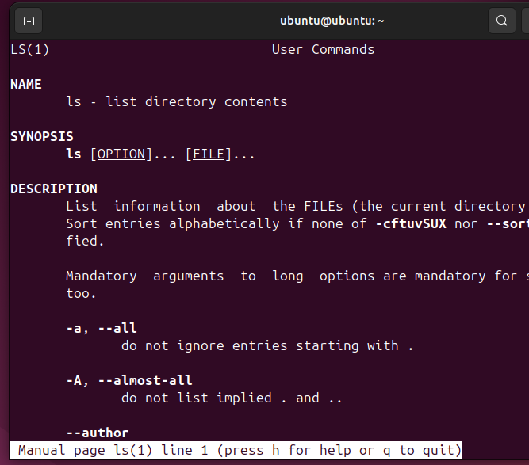

Fungsi perintah `ls` adalah menampilkan isi direktori.

#### Pencipta perintah `ls`


Arti option `-h` adalah *human readable size*.

Option untuk menampilkan direktori secara rekursif adalah:

```text
-R
```

Perintah untuk membuka manual `cp`:

```bash
man cp
```

Fungsi perintah `cp` adalah menyalin file atau direktori.

#### Pencipta perintah `cp`


Arti option `-v` adalah *verbose* yaitu menampilkan proses penyalinan file.

Option agar proses copy bersifat interaktif adalah:

```text
-i
```

---

## Soal 9

### Jawaban

#### Perintah `cat /etc/passwd`


Fungsi perintah `cat` adalah menampilkan isi file.

#### Perintah `grep daemon`


#### Perintah `grep root`


#### Perintah `grep nobody`

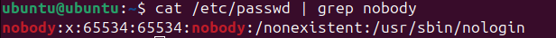

Fungsi pipeline:

```bash
cat /etc/passwd | grep daemon
```

adalah menyaring output sehingga hanya menampilkan data yang mengandung kata `daemon`.

---

## Soal 10

### Jawaban

#### Redirection menggunakan `>`


Perintah tersebut menyimpan output ke dalam file `result.txt`.

#### Lokasi file


Lokasi file:

```text
/home/ubuntu/result.txt
```

#### Redirection kedua menggunakan `>`

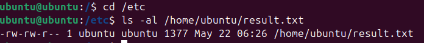

Perintah ini menimpa isi file sebelumnya (*overwrite*).

Fungsi operator:

```text
>
```

adalah menyimpan output ke file dan menimpa isi sebelumnya.

#### Redirection menggunakan `>>`


#### Redirection kedua menggunakan `>>`


Perbedaan:

* `>` digunakan untuk overwrite.
* `>>` digunakan untuk append atau menambahkan isi di akhir file.

---

## Soal 11

### Jawaban

#### Membuat file `2_1.c`

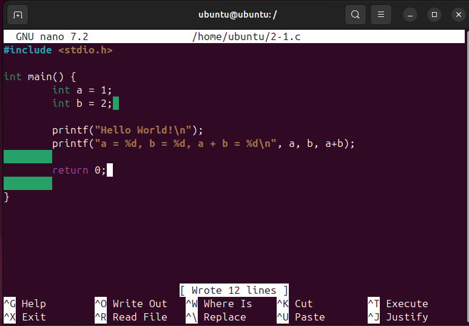

#### Mengkompilasi program


#### Menjalankan program

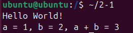

#### Membuat file `2_2.c`


#### Mengkompilasi menjadi `myopen`


#### Menjalankan program

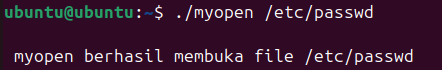

#### Fungsi Program

Program digunakan untuk membuka file menggunakan fungsi `open()`.

* Jika file berhasil dibuka maka program akan menampilkan pesan berhasil.
* Jika file gagal dibuka maka program akan menampilkan pesan error sesuai penyebab kegagalan.

---

# 📚 Referensi

1. Modul Praktikum Sistem Operasi Modul XIII – Perintah Dasar Linux.
2. Linux Documentation Project. (2024). *Linux System Administration Guide*.
3. Shotts, W. E. (2019). *The Linux Command Line* (2nd Edition). No Starch Press.
4. GNU Project. (2024). *GNU Compiler Collection Documentation*.

---

> **Catatan:** Dokumentasi pada bagian Guided menggunakan referensi hasil praktikum yang setara akibat kendala teknis pada lingkungan virtualisasi selama proses instalasi dan pengoperasian sistem. Seluruh pembahasan, analisis, dan jawaban jurnal disusun berdasarkan pemahaman pribadi terhadap materi praktikum.
