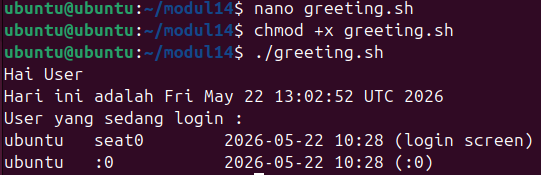
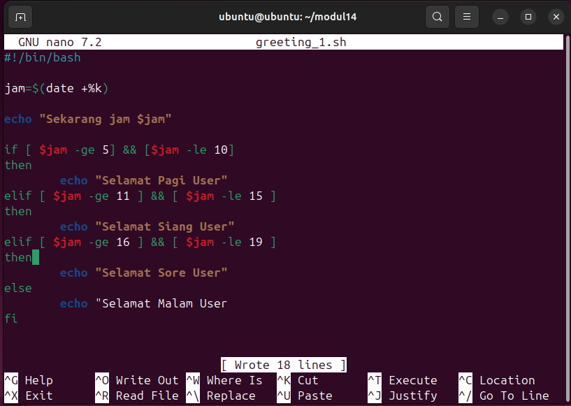
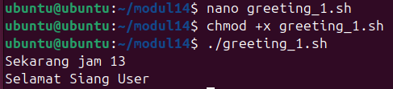
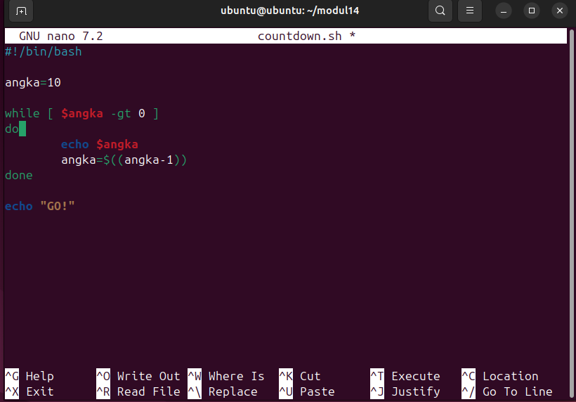
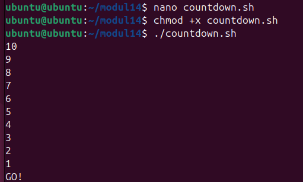
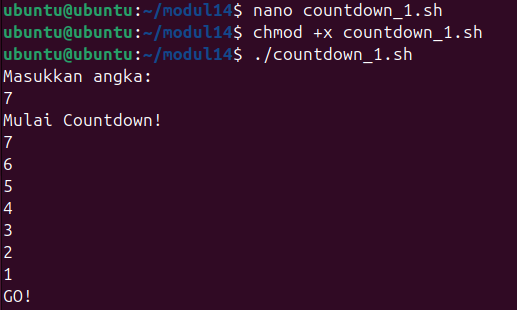
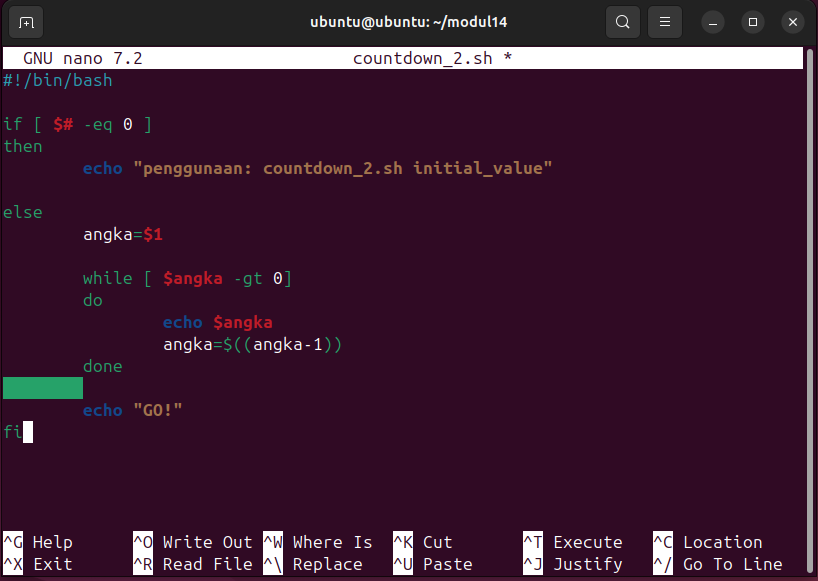
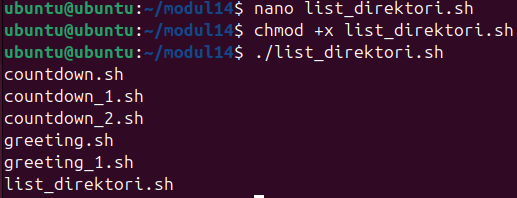

# <h1 align="center">Laporan Praktikum Modul XIV <br> Scripting</h1>

<p align="center">Muhammad Rifqi Al Baqi Ananta - 2311104005</p>

---

# 📝 Dasar Teori

## 1. Shell Script pada Linux

Shell script merupakan sekumpulan perintah Linux yang ditulis dalam sebuah file teks dan dapat dijalankan secara otomatis oleh shell. Shell script banyak digunakan untuk mengotomatisasi pekerjaan yang berulang sehingga pengguna tidak perlu menjalankan perintah satu per satu secara manual. Dengan menggunakan shell script, berbagai tugas administrasi sistem dapat dilakukan dengan lebih cepat dan efisien.

Pada sistem operasi Linux, shell yang paling umum digunakan adalah Bash (*Bourne Again Shell*). File script biasanya memiliki ekstensi `.sh` dan dapat dieksekusi melalui terminal setelah diberikan izin akses menggunakan perintah `chmod`.

---

## 2. Variabel pada Bash Script

Variabel digunakan untuk menyimpan data yang dapat digunakan kembali selama proses eksekusi script berlangsung. Bash tidak mengharuskan pengguna menentukan tipe data secara eksplisit sehingga penggunaan variabel menjadi lebih sederhana dibandingkan beberapa bahasa pemrograman lainnya.

Contoh penggunaan variabel pada Bash:

```bash
nama="Albaqi"
echo $nama
```

Variabel sering digunakan untuk menyimpan hasil input pengguna, hasil perintah sistem, maupun parameter yang diberikan saat script dijalankan.

---

## 3. Pengondisian pada Bash

Pengondisian digunakan untuk menentukan tindakan yang akan dilakukan berdasarkan kondisi tertentu. Bash menyediakan struktur `if`, `elif`, dan `else` untuk menangani berbagai kemungkinan kondisi.

Contoh penggunaan pengondisian:

```bash
if [ $jam -lt 12 ]
then
    echo "Selamat Pagi"
else
    echo "Selamat Malam"
fi
```

Pada praktikum ini pengondisian digunakan untuk menentukan ucapan berdasarkan waktu yang diperoleh dari sistem.

---

## 4. Perulangan pada Bash

Perulangan digunakan untuk menjalankan perintah secara berulang tanpa perlu menuliskan kode yang sama berkali-kali. Bash menyediakan beberapa jenis perulangan, di antaranya `while` dan `for`.

Perulangan `while` digunakan ketika proses pengulangan bergantung pada suatu kondisi tertentu, sedangkan `for` digunakan untuk melakukan iterasi terhadap sekumpulan data atau file.

---

## 5. Input Pengguna dan Parameter Script

Bash menyediakan fasilitas untuk menerima input dari pengguna menggunakan perintah `read`. Selain itu, Bash juga mendukung parameter script yang dapat diberikan ketika file script dijalankan.

Contoh:

```bash
./script.sh 10
```

Nilai parameter dapat diakses menggunakan variabel khusus seperti `$1`, `$2`, dan `$#`. Fitur ini memungkinkan script menjadi lebih fleksibel karena dapat menerima nilai yang berbeda setiap kali dijalankan.

---

# 🛠️ Jurnal

## Soal 1 – Greeting Script

Script `greeting.sh` dibuat untuk menampilkan sapaan kepada pengguna, menampilkan tanggal saat ini, serta menampilkan daftar user yang sedang login ke sistem.

### Source Code


### Hasil Running



---

## Soal 2 – Pengondisian Berdasarkan Waktu

Script `greeting_1.sh` dibuat menggunakan struktur pengondisian untuk menentukan ucapan berdasarkan waktu yang diperoleh dari sistem. Program akan menampilkan ucapan yang berbeda pada pagi, siang, sore, dan malam hari.

### Source Code



### Hasil Running



---

## Soal 3 – Countdown Menggunakan Perulangan

Script `countdown.sh` dibuat menggunakan perulangan untuk menampilkan hitungan mundur dari angka 10 hingga 1, kemudian diakhiri dengan tulisan **GO!**.

### Source Code



### Hasil Running



---

## Soal 4 – Countdown dengan Input Pengguna

Script `countdown_1.sh` dibuat agar dapat menerima masukan angka dari pengguna menggunakan perintah `read`. Nilai yang diberikan pengguna akan digunakan sebagai nilai awal countdown.

### Source Code


### Hasil Running



---

## Soal 5 – Countdown Menggunakan Parameter Script

Script `countdown_2.sh` dibuat untuk menerima nilai awal countdown melalui parameter script. Program juga memeriksa jumlah parameter yang diberikan sehingga dapat menampilkan pesan penggunaan apabila parameter tidak sesuai.

### Source Code



### Hasil Running


---

## Soal 6 – Menampilkan Daftar File dalam Direktori

Script `list_direktori.sh` dibuat menggunakan perulangan `for` untuk menampilkan seluruh file yang terdapat pada direktori aktif. Program melakukan iterasi terhadap setiap file menggunakan karakter wildcard (`*`).

### Source Code


### Hasil Running



---

# 📌 Kesimpulan

Pada praktikum Modul XIV, praktikan mempelajari dasar-dasar pembuatan Bash Script pada sistem operasi Linux. Praktikan memahami cara membuat dan menjalankan script, menggunakan variabel, pengondisian, perulangan, input pengguna, serta parameter script. Selain itu, praktikan juga mempelajari bagaimana Bash Script dapat digunakan untuk mengotomatisasi berbagai pekerjaan sehingga proses administrasi dan pengelolaan sistem Linux menjadi lebih efisien dan terstruktur.

---

# 📚 Referensi

1. Modul Praktikum Sistem Operasi Modul XIV – Scripting.
2. GNU Bash Documentation. (2024). *Bash Reference Manual*.
3. Shotts, W. E. (2019). *The Linux Command Line* (2nd Edition). No Starch Press.
4. Linux Documentation Project. (2024). *Advanced Bash Scripting Guide*.

---

> **Catatan:** Dokumentasi pada bagian jurnal menggunakan referensi hasil praktikum yang setara akibat kendala teknis pada lingkungan virtualisasi selama proses pelaksanaan praktikum. Seluruh pembahasan dan penyusunan laporan dilakukan berdasarkan pemahaman pribadi terhadap materi praktikum.
